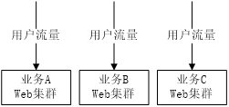
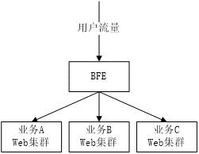
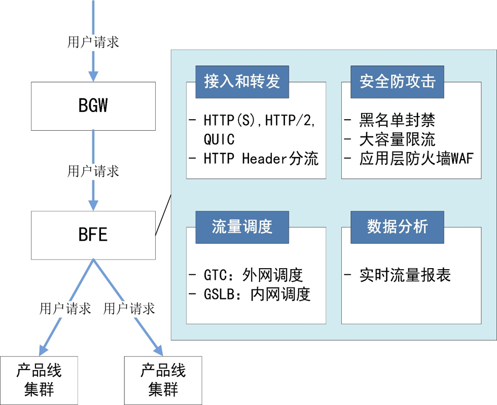
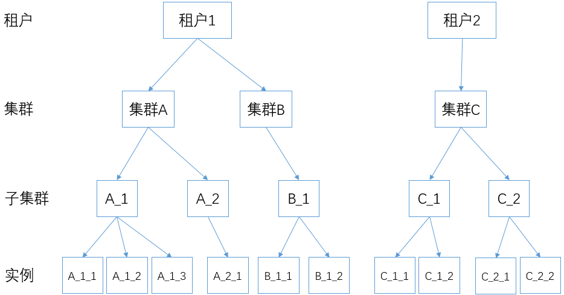
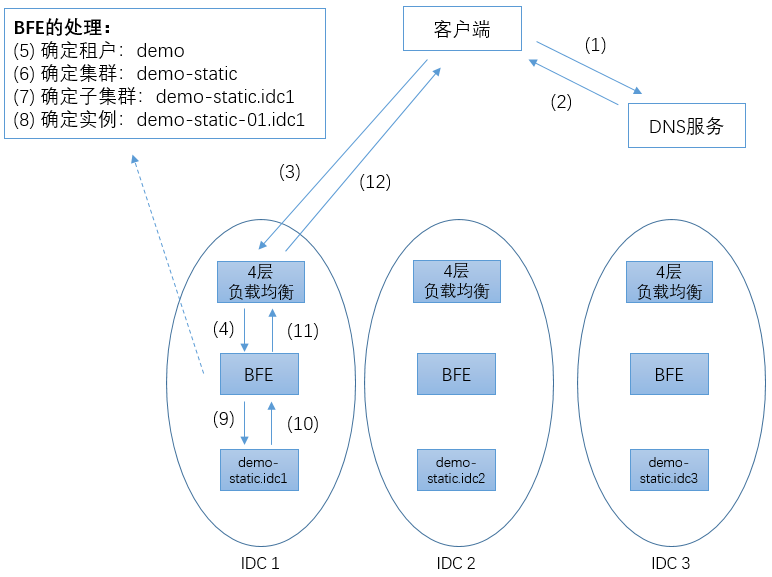

### 简介

BFE是百度统一的七层负载均衡接入转发平台。

在传统的方案中，并不存在统一的七层负载均衡接入层。在存在多个服务的场景下，各业务流量在经过四层负载均衡的转发后，直接到达业务的Web服务集群。

#### 存在的问题

- 功能重复开发
- 运维成本高
-  流量统一控制能力低

#### 带来的优点

- 功能统一开发
- 运维统一管理
- 增强流量控制

#### 主要功能

- 接入和转发
- 流量调度
- 安全防攻击
- 数据分析

#### 缺点

- BFE在HTTP的极端场景下，性能仅为Nginx的1/5.

在长连接场景下BFE与Nginx性能相差会达到1/5. 正常情况下性能是1:1的。

- 在HTTPS场景下BFE需配置RSA加速卡才与Nginx性能相当。
- BFE运维需要重新学习。

#### 优点

- 扩展方便
- 安全性和稳定性
- 支持复杂场景

### 项目对比

- BFE: BFE是一个开源的七层负载均衡系统。
- Nginx: Nginx是HTTP服务、反向代理服务、邮件代理服务、通用TCP/UDP代理服务。
- Envoy: Envoy是开源的边缘和服务代理，为云原生应用而设计。
- Traefik: Traefik是先进的HTTP反向代理和负载均衡。

##### 协议支持

- 这四个系统都支持HTTPS和HTTP/2, 并计划或正在开发支持HTTP/3

#### 健康检查

- BFE和Nginx只支持“被动”模式的健康检查。
- Envoy支持主动、被动和混合模式的健康检查。
- Traefik只支持“主动”模式的健康检查。

#### 集群级别负载均衡

- BFE、Enovy、Traefik都支持集群级别负载均衡
- Nginx不支持集群级别负载均衡

#### 对于转发规则的描述方式

- BFE基于条件表达式
- Nginx基于正则表达式
- Envoy支持基于域名、Path及Header的转发规则
- Traefik支持基于请求内容的分流

### 编程语言

- BFE和Traefik都基于Go语言
- Nginx使用C和Lua开发
- Envoy使用C++开发

### 可插拔架构

- 这4个系统都使用了可插拔架构

### 现有机制

- 路由转发
- 内网流量调度
- 模块插件
- 健康检查
- 限流
- 监控
- 日志
- 超时
- 配置
- HTTPS优化

### BFE 转发模型
在BFE中，有以下基本概念：

- 租户（Tenant）

使用BFE转发的业务，可以基于“租户”的单位来区分。BFE引擎中的配置，比如转发策略、各扩展模块的配置等，都是以租户为单位来区分的。

由于历史原因，在BFE中，租户也被称为“产品线”（Product）。

- 集群（Cluster）

具有同类功能的后端定义为一个集群(Cluster)。对于一个租户，可以定义多个集群。在某些场景，集群也被称为服务（Service）。

在一个租户内，可以使用租户的路由转发表将流量转发给合适的集群。详细的机制可以参考后面章节中关于BFE路由转发机制的说明。

- 子集群（Sub Cluster）

在多数据中心场景下，集群可以划分为多个子集群(Sub Cluster)。通常，可以将集群中处于同一IDC（Internet Data Center）中的后端定义为一个子集群。在某些场景，子集群也被称为实例组（Instance Group）。

子集群概念的引入，主要是为了处理多数据中心场景下的流量调度。详细的机制可以参考后面章节中关于BFE内网流量调度机制的说明。

- 实例（Instance）

每个子集群可包含多个后端服务实例（Instance）。每个后端实例通过“IP地址 + 端口号”标识。

#### 转发过程

[深入理解BFE](https://github.com/baidu/bfe-book)

