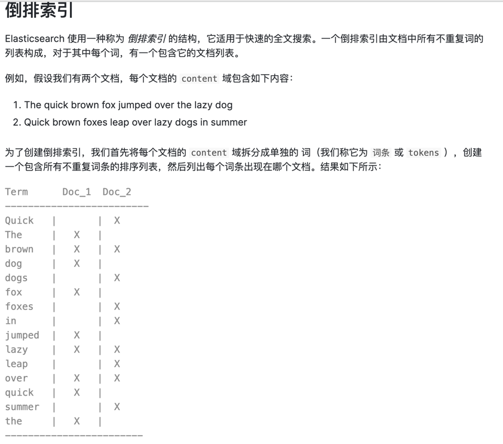
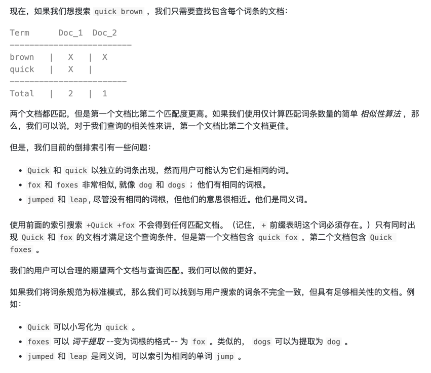
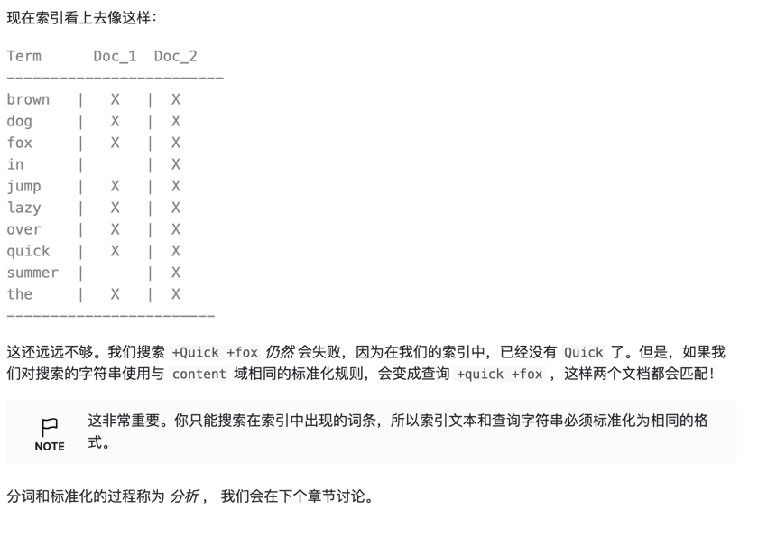

# elasticsearch

- 主副节点不会在同一个服务上

###  Elasticsearch 如何知道一个文档应该存放到哪个分片中呢？
根据公式：shard = hash(routing) % number_of_primary_shards

routing 是一个可变值，默认是文档的 _id ，也可以设置成一个自定义的值。
routing 通过 hash 函数生成一个数字，然后这个数字再除以 number_of_primary_shards （主分片的数量）后得到 余数 。
这个分布在 0 到 number_of_primary_shards-1 之间的余数，就是我们所寻求的文档所在分片的位置。

这就解释了为什么我们要在创建索引的时候就确定好主分片的数量 并且永远不会改变这个数量：因为如果数量变化了，那么所有之前路由的值都会无效，文档也再也找不到了。

### 主分片和副本分片如何交互？
我们可以把请求发到任意节点。每个节点都具有处理请求的能力。每个节点都知道文档所在的位置。可以直接把请求转发至对应节点。
该操作称为协调节点。

### _search 设置了timeout是否是停止查询了？
timeout不是停止查询了， 它仅仅是告诉正在协调的节点返回到目前为止收集到的结果并关闭连接。在后台，其他分片可能仍在执行查询即使请求已经响应了。

### 倒排索引

### 分析过程
分析过程：
- 将一块文本分成适合于倒排索引的独立的 词条
- 将这些词条统一化为标准格式以提高它们的“可搜索性”，或者 recall

分析器执行上面的工作，实际上是将三个功能封装到了一个包里。

#### 字符过滤器
首先，字符串按顺序通过每个 字符过滤器 。他们的任务是在分词前整理字符串。一个字符过滤器可以用来去掉HTML，或者将 & 转化成 and。
#### 分词器
其次，字符串被 分词器 分为单个的词条。一个简单的分词器遇到空格和标点的时候，可能会将文本拆分成词条。
#### Token过滤器
最后，词条按顺序通过每个 token 过滤器 。这个过程可能会改变词条（例如，小写化 Quick ），删除词条（例如， 像 a， and， the 等无用词），或者增加词条（例如，像 jump 和 leap 这种同义词）。
过滤掉无用的字符串。

### 分布式搜索
#### 查询阶段

- 客户端发送一个 search 请求到 Node 3 ， Node 3 会创建一个大小为 from + size 的空优先队列。
- Node 3 将查询请求转发到索引的每个主分片或副本分片中。每个分片在本地执行查询并添加结果到大小为 from + size 的本地有序优先队列中。
- 每个分片返回各自优先队列中所有文档的 ID 和排序值给协调节点，也就是 Node 3 ，它合并这些值到自己的优先队列中来产生一个全局排序后的结果列表。

#### 取回阶段

- 协调节点辨别出哪些文档需要被取回并向相关提交多个GET请求
- 每个请求加载并丰富文档，如果有需要的话，接着返回文档给协调节点
- 一旦所有的文档都被取回了，协调节点返回结果给客户端
