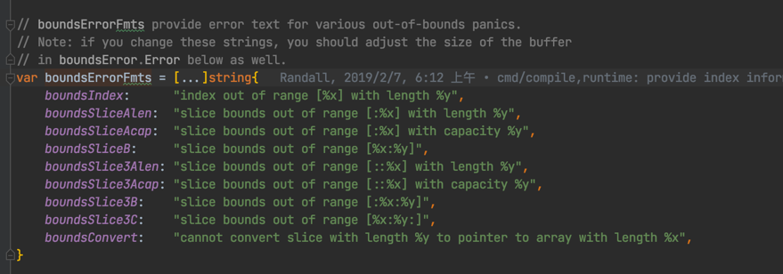

# go_master
深入学习go+N+M

## 目录
- [ ] error 
- [ ] concurrency
- [x] runtime
- [ ] testing
- [ ] 微服务概览与治理
- [ ] 工程化实践
- [ ] 分布式缓存/分布式事务
- [x] 网络编程
- [ ] 日志&指标&链路追踪
- [ ] DNS&CDN
- [x] kafka
- [x] MySQL
- [x] Local Cache
- [ ] json
- [x] Redis
- [ ] SingleFlight
- [x] JWT
- [x] Leaf
- [x] Kit
- [x] [Code Review Comments](https://github.com/golang/go/wiki/CodeReviewComments)
- [x] go-zero
- [x] 可重入锁
- [x] 浅谈分布式存储系统数据分布方法
- [x] 分布式唯一ID生成调研
- [x] leetcode
- [x] slow ddos
- [x] trie
- [x] graceful
- [x] mermaid
- [x] rand string
- [x] BFE
- [x] decoration
- [ ] MQ
- [x] Redis distributed locks

冒个泡。。。

###### 一种switch case的用法。


###### 一种判断值超出范围的用法。


###### 数组的用法


###### golang 查看汇编
[Go命令行—compile](http://t.zoukankan.com/linguoguo-p-11699006.html)
```go
go tool compile -S main.go
```

###### 加入nocopy 
```go
// noCopy may be embedded into structs which must not be copied
// after the first use.
//
// See https://golang.org/issues/8005#issuecomment-190753527
// for details.
type noCopy struct{}

// Lock is a no-op used by -copylocks checker from `go vet`.
func (*noCopy) Lock()   {}
func (*noCopy) Unlock() {}
```

###### channel 定位于通信，用于一发一收的场景，sync.Cond 定位于同步，用于一发多收的场景。
[Golang sync.Cond 简介与用法](https://blog.csdn.net/K346K346/article/details/95673050)