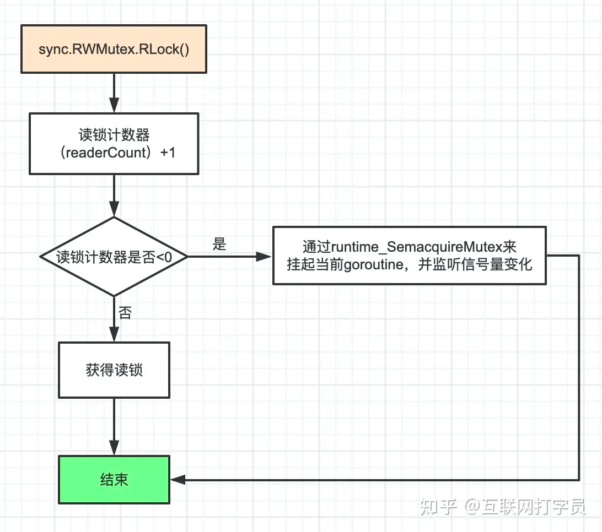
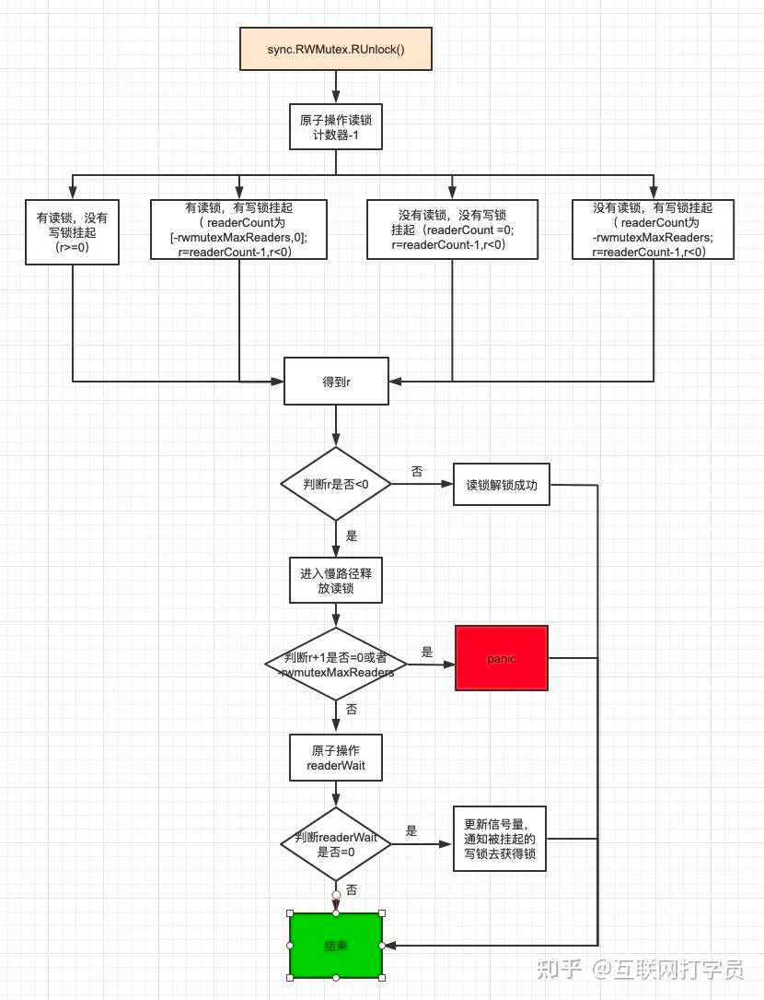

# RWMutex

- Lock 加写锁
- UnLock 解写锁
- RLock 加读锁
- RUnLock 解读锁


## 用法
直接UnLock 会painc
```
fatal error: sync: Unlock of unlocked RWMutex
```


## 源码解析

读锁：
```go
func (rw *RWMutex) RLock() {
    // 竞态检测，可忽略
    if race.Enabled {
        _ = rw.w.state
        race.Disable()
    }
    // 每次goroutine获得读锁，readerCount+1
    // 1）如果写锁被获取，那么readerCount在 -rwmutexMaxReaders与0之间
    // 这时挂起获取读锁的goroutine。
    // 2）如果写锁未被获取，那么readerCount>=0，获取读锁,不阻塞。

    // 通过readerCount的正负判断读锁与写锁互斥,
    // 如果有写锁存在就挂起读锁的goroutine,多个读锁可以并行
    if atomic.AddInt32(&rw.readerCount, 1) < 0 {
        runtime_SemacquireMutex(&rw.readerSem, false, 0)
    }

    if race.Enabled {
        race.Enable()
        race.Acquire(unsafe.Pointer(&rw.readerSem))
    }
}
```
解读锁：
```go
func (rw *RWMutex) RUnlock() {
	if race.Enabled {
		_ = rw.w.state
		race.ReleaseMerge(unsafe.Pointer(&rw.writerSem))
		race.Disable()
	}
	// 读锁计数器 -1 如果小于0 表示没有其余读锁了   进入满释放
	if r := atomic.AddInt32(&rw.readerCount, -1); r < 0 {
		// Outlined slow-path to allow the fast-path to be inlined
		rw.rUnlockSlow(r)
	}
	if race.Enabled {
		race.Enable()
	}
}


func (rw *RWMutex) rUnlockSlow(r int32) {
if r+1 == 0 || r+1 == -rwmutexMaxReaders {
race.Enable()
throw("sync: RUnlock of unlocked RWMutex")
}
// A writer is pending. //获取写锁时需要等待的读锁释放数量 -1 如果等于0 调用释放方法
if atomic.AddInt32(&rw.readerWait, -1) == 0 {
// The last reader unblocks the writer. // 最后一个读卡器解除阻止写入器
runtime_Semrelease(&rw.writerSem, false, 1)
}
}

```


