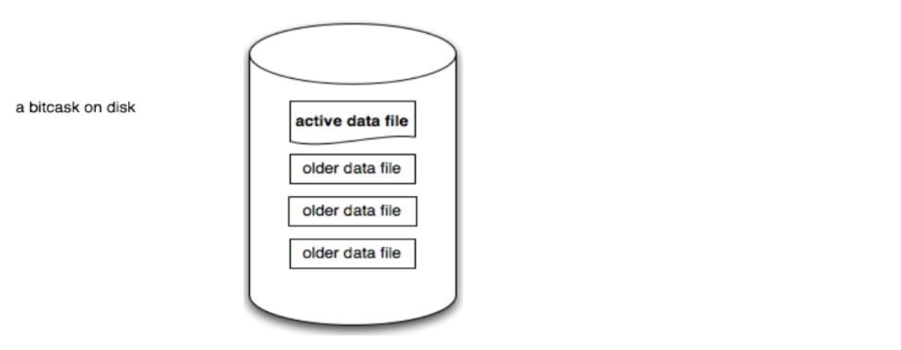
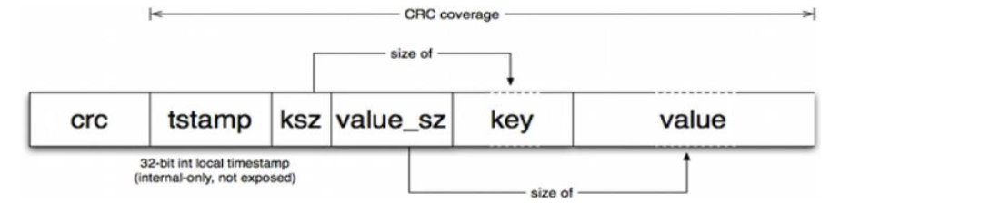
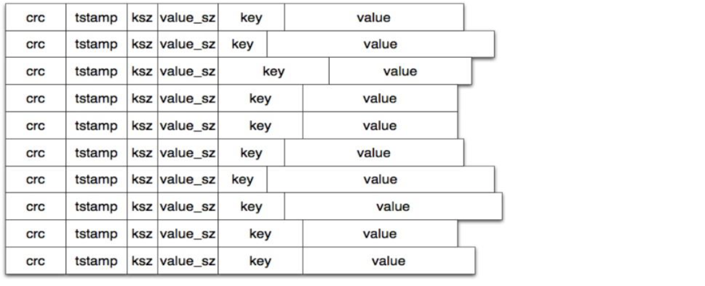
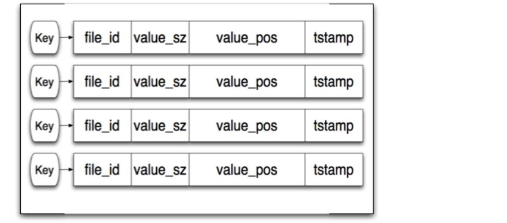
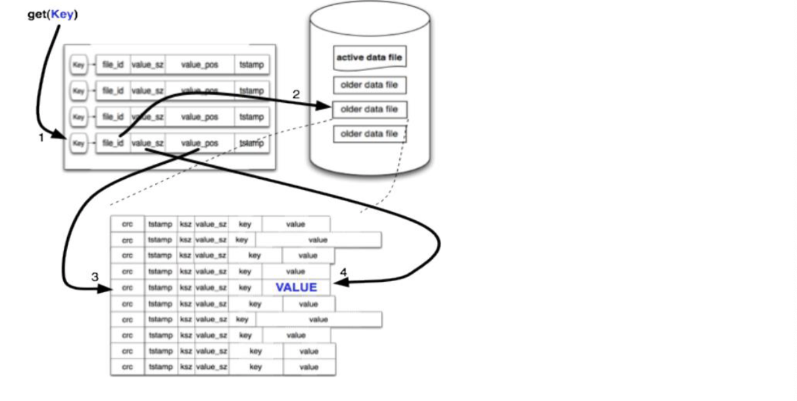
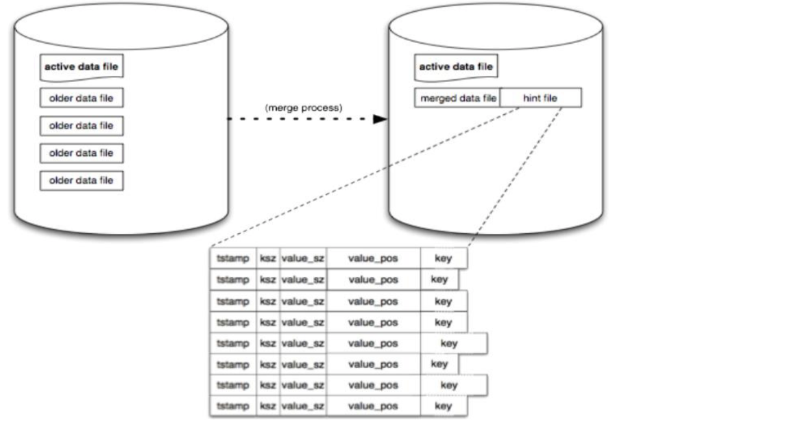
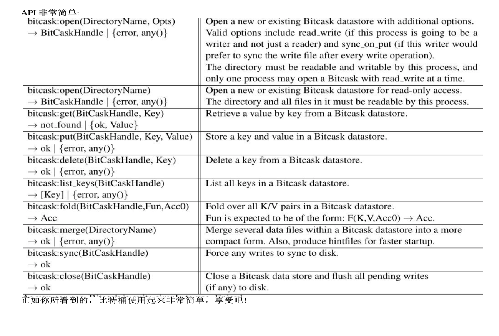

# Bitcask
用于快速键值对数据的日志结构哈希表

Bitcask想要实现的特性有

- 读写低延迟
- 高吞吐

- 处理大数据，没有I/O退化
- 健壮性强，具有快速恢复、数据不丢失
- 相对简单
- 默认实现Riak

在Bitcask之前没有一种本地键值对存储系统实现了上诉所有特性。

​	Bitcask实例是一个目录，强制只有一个操作系统进程在特定的时间打开BitCask进行写操作。你可以把这个进程想象成“数据库服务器”。在任何时候该目录中都有一个文件处于“active”状态，供服务器写入。当该文件达到一个阈值时，它会被关闭，并创建一个新的active data file。一旦一个文件被关闭，无论是主动的还是由于服务器退出，它都被认为是不可变的，并且永远不会被打开以再次写入。

​	active data file只通过追加写入，这意味着顺序写入不需要磁盘寻道。每个键值对写入格式也很简单:

​	每次写入时，都将一个新kv附加到活动文件中，删除时只是简单写入一个特殊的值，该值将在下一次合并时被删除。因此，Bitcask数据文件只是这些KV的线性队列。

​	在添加完成后，一个名为“keydir”的内存结构会被更新。keydir只是一个哈希表，它将Bitcask中的每个键映射到一个固定大小的结构，给出该键最近写入的文件、偏移量和大小。

​	当写入发生时，keydir会以原子方式更新最新数据的位置。旧的数据依然存在于磁盘上，但任何新的读取都会使用keydir中可用的最新版本。

​	读取一个值很简单，只需要一次磁盘寻道。在keydir中查找键，从中获取需要查找的文件、id、位置和大小来读取数据。

​	随着时间的推移，这个简单的模型可能会占用很多空间，因此我们只是写新值，并没有去改旧值。我们称之为“merging”的合并过程解决了这个问题。合并过程迭代Bitcask中所有非活动的文件，并产生一组数据文件作为输出，其中仅包含每个当前密钥的“active”或最新版本。

​	当进程打开一个Bitcask时，他会检查在同一个VM中是否已经有另一个进程正在使用这个Bitcask。

其他细节：

- Bitcask 不执行任何数据压缩
- 读写低延迟
- 高吞吐量
- 备份与恢复
- 简单

## Refer

[Bitcask](https://riak.com/assets/bitcask-intro.pdf)

