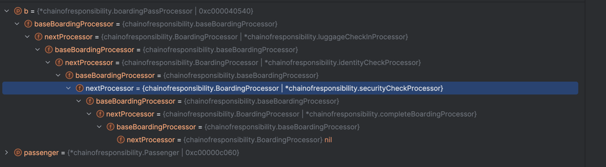

# 责任链模式
责任链模式是一种行为设计模式，允许你将请求沿着处理者链进行发送。收到请求后，每个处理者均可对请求进行处理，或将其传递给链上的下个处理者。
该模式允许多个对象来对请求进行处理，而无需让发送者类与具体接收者类相耦合。链可在运行时由遵循标准处理者接口的任意处理者动态生成。

简单来说就是先实例化一个对象，将这个对象传递给一个实现标准接口的处理者，处理者处理或者不处理之后再将这个对象传递给下一个处理者，直到最后一个处理者。

- 请求可以流经处理链的所有节点，不同节点会对请求做不同职责的处理；
- 可以通过上下文参数保存请求对象及上游节点的处理结果，供下游节点依赖，并进一步处理；
- 处理链可支持节点的异步处理，通过实现特定接口判断，是否需要异步处理；
- 责任链对于请求处理节点可以设置停止标志位，不是异常，是一种满足业务流转的中断；
- 责任链的拼接方式存在两种，一种是节点遍历，一个节点一个节点顺序执行；另一种是节点嵌套，内层节点嵌入在外层节点执行逻辑中，类似递归，或者“回”行结构；
- 责任链的节点嵌套拼接方式多被称为拦截器链或者过滤器链，更易于实现业务流程的切面，比如监控业务执行时长，日志输出，权限校验等；

demo中最终构成的链路结构如下图所示：
