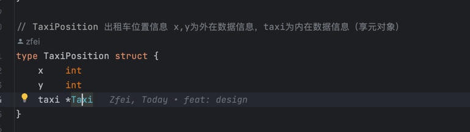

# 享元设计模式
享元是一种结构型设计模式，它允许你在消耗少量内存的情况下支持大量对象。

模式通过共享多个对象的部分状态来实现上述功能。换句话来说，享元会将不同对象的相同数据进行缓存以节省内存。

共享状态的对象被称为享元。享元对象中存储的这些数据称为内部状态。调用方必须将享元的其余状态传递给它，这些状态被称为外部状态。

业务逻辑中仅需要更新x、y Taxi作为固定对象重复利用，减少内容开支。