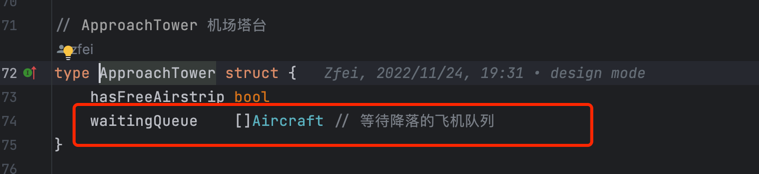

# 中介者模式
中介者模式是一种行为设计模式，能让你减少对象之间混乱无序的依赖关系。该模式会限制对象之间的直接交互，迫使它们通过一个中介者对象进行合作，将网状依赖变为星状依赖。

中介者模式与观察者模式之间的区别是，中介者模式解决的是同类或者不同类的多个对象之间多对多的依赖关系，观察者模式解决的是多个对象与一个对象之间的多对一的依赖关系。

中介struct有对象的interface, 对象实现interface，并将中介作为入参，从而可使用中介的公共参数。
