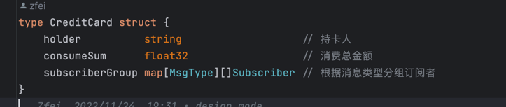

# 观察者模式
观察者模式是一种行为设计模式，允许你定义一种订阅机制，可在对象事件发生时通知多个 “观察” 该对象的其他对象。

观察者模式提供了一种作用于任何实现了订阅者接口的对象的机制，可对其事件进行订阅和取消订阅。

观察者模式是最常用的模式之一，是事件总线，分布式消息中间件等各种事件机制的原始理论基础，常用于解耦多对一的对象依赖关系；

当被观察者通过异步实现通知多个观察者时就相当于单进程实例的消息总线；

- 同时还可以根据业务需要，将被观察者所有数据状态变更进行分类为不同的主题，观察者通过不同主题进行订阅；
- 同一个主题又可分为增加，删除，修改事件行为；
- 每个主题可以实现一个线程池，多个主题通过不同的线程池进行处理隔离，线程池可以设置并发线程大小、缓冲区大小及调度策略，比如先进先出，优先级等策略；
- 观察者处理事件时有可能出现异常，所以也可以注册异常处理函数，异常处理也可以通过异常类型进行分类；
- 根据业务需求也可以实现通知异常重试，延迟通知等功能；

实现方案与备忘录模式相识，都是用一个map存储需要执行的interface。触发订阅事件时，执行map中的interface。