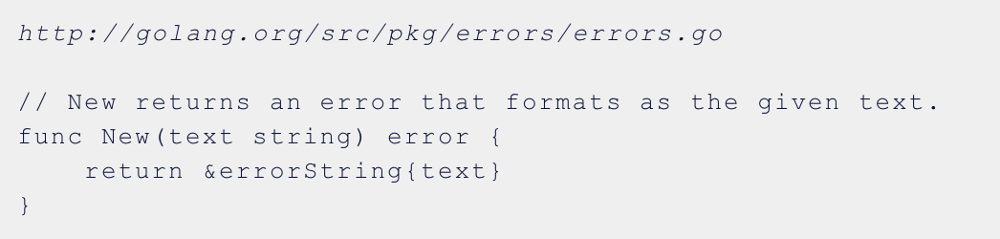
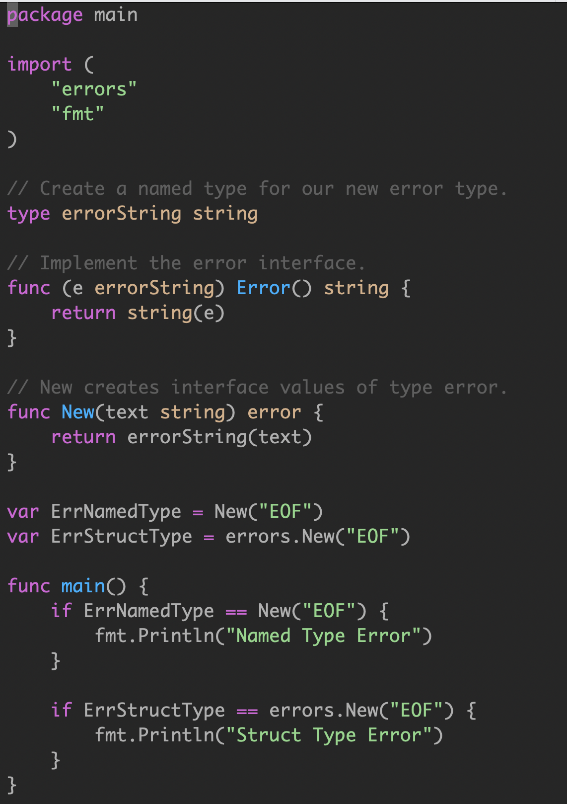

# Error
基础库中大量自定义的error
```go
var {
	ErrorSomething = errors.New("somethind")
}
```
errors.New()返回的是内部errorString对象的指针


# Sentinel Error
预定义的特定错误，我们称为senntinel error
- Sentinel errors 成为你 API 公共部分。
如果您的公共函数或方法返回一个特定值的错误，那么该值必须是公共的，当然要有文档记录，这会增加 API 的表面积。
如果 API 定义了一个返回特定错误的 interface，则该接口的所有实现都将被限制为仅返回该错误，即使它们可以提供更具描述性的错误。
比如 io.Reader。像 io.Copy 这类函数需要 reader 的实现者比如返回 io.EOF 来告诉调用者没有更多数据了，但这又不是错误。
- Sentinel errors 在两个包之间创建了依赖。
- sentinel errors 最糟糕的问题是它们在两个包之间创建了源代码依赖关系。例如，检查错误是否等于 io.EOF，您的代码必须导入 io 包。这个特定的例子听起来并不那么糟糕，因为它非常常见，但是想象一下，当项目中的许多包导出错误值时，存在耦合，项目中的其他包必须导入这些错误值才能检查特定的错误条件（in the form of an import loop）。
- 结论: 尽可能避免 sentinel errors。
我的建议是避免在编写的代码中使用 sentinel errors。在标准库中有一些使用它们的情况，但这不是一个您应该模仿的模式。

# Wrap erros
通过使用pkg/errors包，我们可以向错误值添加上下文，这种方式即可以由人也可以由机器检查。

# ref
[【Go进阶—基础特性】错误](https://segmentfault.com/a/1190000041658072)

