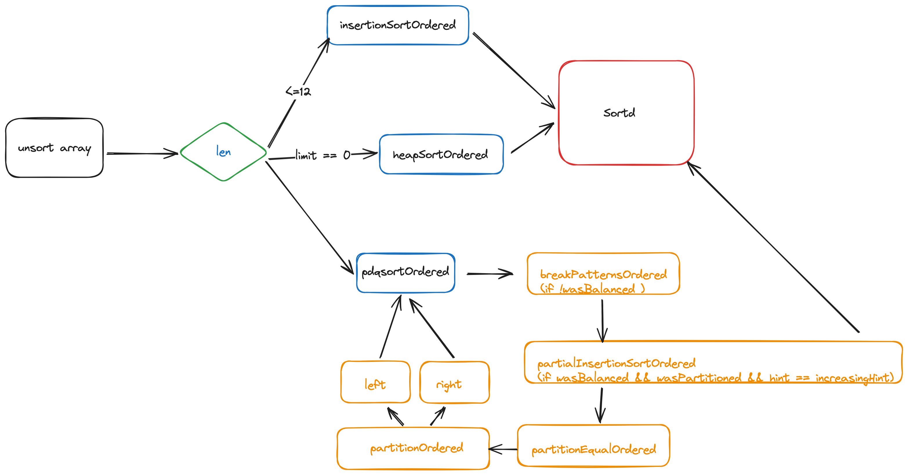

Go1.19 之后的排序算法迭代成pdqsort。

- 那么什么是pdqsort？
- pdqsort相比传统的插入、快速排序有何优势？

根据源码的注释可以了解到pdq是pattern-defeating quiclsort 的缩写。另外这个算法实现是由字节贡献给Go团队的。

[这是pdqsort的论文地址。](https://arxiv.org/pdf/2106.05123.pdf)

[C++实现](https://github.com/orlp/pdqsort)

[Rust实现](https://docs.rs/pdqsort/latest/pdqsort/)

但是Go的实现没有使用BlockQuicksort。

下面让我们细究为什么要用pdqsort。

## 插入排序 InsertionSort

简介：将元素不断插入已排序的序列中。

实现：后续元素插入有序序列中，即不断交换，直到找到第一个比其小的元素。

时间复杂度：

| Best | Avg    | Worst  |
| ---- | ------ | ------ |
| O(n) | O(n^2) | O(n^2) |

Go实现demo:

```go
// insertionSortOrdered sorts data[a:b] using insertion sort.
func insertionSortOrdered[E cmp.Ordered](data []E, a, b int) {
	for i := a + 1; i < b; i++ {
		for j := i; j > a && cmp.Less(data[j], data[j-1]); j-- {
			data[j], data[j-1] = data[j-1], data[j]
		}
	}
}
```

## 快速排序 QuickSort

简介：递归，不断分割序列直到序列整体有序。

实现：

- 选定一个pivot（中轴点）
- 使用pivot分割序列，分成元素比pivot大和元素比pivot小的两个序列

| Best      | Avg       | Worst  |
| --------- | --------- | ------ |
| O(n*logn) | O(n*logn) | O(n^2) |

Go实现Demo：

```go
func pdqsortOrdered[E cmp.Ordered](data []E, a, b, limit int) {
	//...
	// 暂时省略优化点
		leftLen, rightLen := mid-a, b-mid
		balanceThreshold := length / 8
		if leftLen < rightLen {
			wasBalanced = leftLen >= balanceThreshold
			pdqsortOrdered(data, a, mid, limit)
			a = mid + 1
		} else {
			wasBalanced = rightLen >= balanceThreshold
			pdqsortOrdered(data, mid+1, b, limit)
			b = mid
		}
	}
}
```

## 堆排序 HeapSort

简介：利用堆的性质形成的排序算法

实现：

- 构造一个大顶堆
- 将根节点（最大元素交换到最后一个位置，调整整个堆），如此反复

| Best      | Avg       | Worst     |
| --------- | --------- | --------- |
| O(n*logn) | O(n*logn) | O(n*logn) |

Go实现Demo:

```go

func heapSortOrdered[E cmp.Ordered](data []E, a, b int) {
	first := a
	lo := 0
	hi := b - a

	// Build heap with greatest element at top.
	for i := (hi - 1) / 2; i >= 0; i-- {
		siftDownOrdered(data, i, hi, first)
	}

	// Pop elements, largest first, into end of data.
	for i := hi - 1; i >= 0; i-- {
		data[first], data[first+i] = data[first+i], data[first]
		siftDownOrdered(data, lo, i, first)
	}
}


// siftDownOrdered implements the heap property on data[lo:hi].
// first is an offset into the array where the root of the heap lies.
func siftDownOrdered[E cmp.Ordered](data []E, lo, hi, first int) {
	root := lo
	for {
		child := 2*root + 1
		if child >= hi {
			break
		}
		if child+1 < hi && cmp.Less(data[first+child], data[first+child+1]) {
			child++
		}
		if !cmp.Less(data[first+root], data[first+child]) {
			return
		}
		data[first+root], data[first+child] = data[first+child], data[first+root]
		root = child
	}
```

## 汇总

|               | Best      | Avg       | Worst     |
| ------------- | --------- | --------- | --------- |
| InsertionSort | O(n)      | O(n^2)    | O(n^2)    |
| QuickSort     | O(n*logn) | O(n*logn) | O(n^2)    |
| HeapSort      | O(n*logn) | O(n*logn) | O(n*logn) |

通过这个表格可以看出插入排序在数据较少时时间复杂度最小，堆排序最稳定。

而pdqsort就是结合取各家之长的一种混合算法。

另外在Go的实现中进行了不少优化。

## 源码剖析

函数签名：

```go
func pdqsortOrdered[E cmp.Ordered](data []E, a, b, limit int)
```

limit 是调用堆排序之前快速排序执行的次数。

```go
	const maxInsertion = 12
```

插入排序的阈值为12，即<=12时会调用插入排序。

```go
length := b - a
		// 长度小于12 使用插入排序
		if length <= maxInsertion {
			insertionSortOrdered(data, a, b)
			return
		}
```

```go
	// Fall back to heapsort if too many bad choices were made.
		if limit == 0 {
			// 最后使用堆排序
			heapSortOrdered(data, a, b)
			return
		}
```

当limit == 0 时最终降级为堆排序。

除此之外pdqsortOrdered还有两个辅助变量用于优化快速排序。分别为

```go
	var (
		wasBalanced    = true // whether the last partitioning was reasonably balanced
		wasPartitioned = true // whether the slice was already partitioned
	)
```

- 分区是否平衡标志
- slice是否分区有序

接下来让我们详细看看快排有那些优化点。

```go
	// If the last partitioning was imbalanced, we need to breaking patterns.
		// 如果最后一个分区不平衡，我们需要打乱分区
		if !wasBalanced {
			breakPatternsOrdered(data, a, b)
			limit--
		}

```

这里看下breakPatternsOrdered函数：

```go
// breakPatternsOrdered scatters some elements around in an attempt to break some patterns
// that might cause imbalanced partitions in quicksort.
func breakPatternsOrdered[E cmp.Ordered](data []E, a, b int) {
	length := b - a
	if length >= 8 {
		random := xorshift(length)
		modulus := nextPowerOfTwo(length)

		for idx := a + (length/4)*2 - 1; idx <= a+(length/4)*2+1; idx++ {
			// 产生一个随机数 取 mol
			other := int(uint(random.Next()) & (modulus - 1))
			if other >= length {
				other -= length
			}
			data[idx], data[a+other] = data[a+other], data[idx]
		}
	}
}
```

通过偏移量产生一个随机交换下标。有兴趣可以阅读下这篇论文：

https://www.jstatsoft.org/article/view/v008i14/xorshift.pdf

选择pivot。

```go
pivot, hint := choosePivotOrdered(data, a, b)
```

### 优化提速

让我们详细看下choosePivotOrdered函数

```go
// choosePivotOrdered chooses a pivot in data[a:b].
//
// [0,8): chooses a static pivot. 8位以内 静态选点
// [8,shortestNinther): uses the simple median-of-three method. 8-50 简单三点
// [shortestNinther,∞): uses the Tukey ninther method. 50 - ∞ 使用Tukey ninther method
func choosePivotOrdered[E cmp.Ordered](data []E, a, b int) (pivot int, hint sortedHint)
```

可以看到这里有个找pivot的优化点：

- <=8 选择固定元素
- <=50 采样三个元素
- *>*=50 采样九个元素

优化的采样方式使得pdqsort有探知序列当前状态的能力。

1） 采样的元素都是逆序排列，序列可能已经逆序 => 翻转整个序列 2） 采样的元素都是顺序序列，序列可能已经有序 => 使用插入排序

```go
if hint == decreasingHint {
			reverseRangeOrdered(data, a, b)
			// The chosen pivot was pivot-a elements after the start of the array.
			// After reversing it is pivot-a elements before the end of the array.
			// The idea came from Rust's implementation.
			pivot = (b - 1) - (pivot - a)
			hint = increasingHint
		}
```

当`wasBalanced` == true `wasPartitioned` == true 并且是增序时则调用部分插入排序直接返回结果。

### 应对重复元素很多的情况

采样pivot的时候检测重复度不是很好，因为采样数量有限，不一定能采到相同元素。

slice包含多个重复元素时将slice分为等于和大于pivot的元素集合。

如果两次partition生成的pivot相同，即partition进行了无效分割，此时认为pivot的值为重复元素，使用partitionEqual将重复元素排列在一起，减少重复元素对于pivot选择的干扰

## 总结

pdqsort相比Go1.18以前的排序算法有着2x-60x的提升。

流程图：



## reference

[pdqsort](https://github.com/zhangyunhao116/pdqsort)

[Go 1.19的排序算法](https://juejin.cn/post/7108577616398909454?from=search-suggest)

[Go1.19排序算法 pdqsort 学习](https://juejin.cn/post/7238507402834853949)