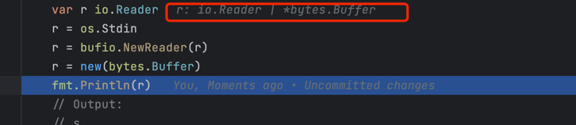

# 反射三大定律（The Laws of Reflection）

## Types and interfaces 类型和接口

因为反射建立在type之上，所以让我们首先回顾一下Go中的类型。

Go是静态类型语言，每个变量都有一个静态类型，也就是说在编译时就已知且固定了。比如`int` `float32` `*MyType` `[]byte` 等等。如何我们声明：

```go
type MyInt int
var i int
var j int
```

那么`i` 的类型为`int` ，而`j`的类型为`MyInt` 。 变量`i`和`j`具有不同的静态类型，并且， 尽管它们具有相同的基础类型， 如果没有转换，它们就不能相互分配。

类型的另一个重要类型时interface，代表固定的方法集。（在讨论反射时，我们可以忽略interface作为多态时的约束。）接口变量可以存储任何具体值（非接口），只要该值实现了接口的方法。一个著名的例子是`io.Reader` `io.Writer`， io包中的类型`Reader` `Writer`

```go
// Reader is the interface that wraps the basic Read method.
type Reader interface {
    Read(p []byte) (n int, err error)
}

// Writer is the interface that wraps the basic Write method.
type Writer interface {
    Write(p []byte) (n int, err error)
}
```

任何使用该签名实现`Read`/ `Write` 方法的类型都可以说实现了`io.Reader`/`io.Writer`。 这意味着类型变量`io.Reader` 可以保存人了类型具有`Read`方法的值。

```go
var r io.Reader
r = os.Stdin
r = bufio.NewReader(r)
r = new(bgtes.Buffer)
// and so on
```

需要知道的是，无论`r`的具体值是什么,r的类型始终是io.Reader： Go 是静态类型的，r的静态类型是`io.Reader`



接口类型的另一个极其重要的例子是空接口：

```go
interface{}
```

等效于别名

```go
any
```

它表示空的方法集，并且可以满足任何值，如果每个值都有零个或多个方法。

有人说Go的接口是动态类型的， 但这是误导性的。 它们是静态类型的：接口类型的变量始终具有相同的静态类型， 即使在运行时存储在接口变量中的值可能会改变类型， 该值将始终满足接口。

## 接口的表示

接口类型存储了分配给变量的具体值和该值的类型描述符号。准确地说，该值是底层的具体数据项实现接口，类型描述该项目的完整类型。EX:

```go
var r io.Reader
tty, err := os.OpenFile("/dev/tty", os.O_RDWE,0)
if err != nil {
  return nil, err
}
t = tty

```

`r` 示意性地包含（值，类型）对， (`tty``*os.File`)。 请注意，类型“*os.File”实现了“Read”以外的方法； 即使接口值仅提供对“Read”方法的访问， 里面的值携带了关于该值的所有类型信息。 这就是为什么我们可以这样做：

```go
var w io.Writer
w = r.(io.Writer)
```

此赋值中的表达式是类型断言； 它断言“r”中的项目也实现了“io.Writer”， 所以我们可以将它分配给“w”。 赋值后，`w` 将包含 (`tty`*os.File`) 对。 这与“r”中保存的对相同。接口的静态类型 确定可以使用接口变量调用哪些方法， 尽管里面的具体值可能有更大的方法集。

或者我们可以这么做：

```go
var empty interface{}
empty = w
```

我们的空接口值“empty”将再次包含同一对， (`tty``*os.File`)。 这很方便：空接口可以保存任何值并包含所有 我们可能需要有关该值的信息。

（这里我们不需要类型断言，因为静态地知道 `w` 满足空接口。 在我们将值从“Reader”移动到“Writer”的示例中， 我们需要明确并使用类型断言，因为“Writer”的方法 不是“Reader”的子集。）

Now we’re ready to reflect.

## 第一反射定律 反射可以获取类型信息

从根本上里说，反射只是一种检查类型和类型的机制。存储在接口变量的键值对。首先，我们需要了解反射包中的两个类型： Type 和Value，和两个简单的函数`reflect.TypeOf` reflect.ValueOf ， 从接口值中检索`reflect.Type` 和`reflect.Value` 

#### 从TypeOf 开始

```go
func ExampleDemo1() {
	var x float64 = 32.2
	fmt.Println("type:", reflect.TypeOf(x))
	// Output:
	// type: float64
}
```

当我们调用`reflect.TypeOf(x)` `x` 首先存储在一个空接口中,然后将其作为参数传递，`reflect.TypeIf` 解压该空接口来恢复类型信息。

```go
// TypeOf returns the reflection Type that represents the dynamic type of i.
// If i is a nil interface value, TypeOf returns nil.
func TypeOf(i any) Type {
	eface := *(*emptyInterface)(unsafe.Pointer(&i))
	// Noescape so this doesn't make i to escape. See the comment
	// at Value.typ for why this is safe.
	return toType((*abi.Type)(noescape(unsafe.Pointer(eface.typ))))
}
```

emptyInterface 定义如下：

```go
// emptyInterface is the header for an interface{} value.
type emptyInterface struct {
	typ  *abi.Type
	word unsafe.Pointer
}
```

`reflect.Type` 和 `reflect.Value` 都有很多方法可供我们检查 并操纵它们。 一个重要的例子是“Value”有一个“Type”方法，该方法返回 “reflect.Value”的“Type”。 另一个是`Type`和`Value`都有一个`Kind`方法返回 一个常量，指示存储的项目类型： `Uint``Float64``Slice` 等等。 另外，“Value”上具有“Int”和“Float”等名称的方法可以让我们获取值 （如“int64”和“float64”）存储在：

```go
func ExampleDemo3() {
	var x float64 = 32.2
	v := reflect.ValueOf(x)
	fmt.Println("type:", v.Type())
	fmt.Println("kind is float64:", v.Kind() == reflect.Float64)
	fmt.Println("value:", v.Float())
	fmt.Println(v.CanSet())
	// Output:
	// type: float64
	// kind is float64: true
	// value: 32.2
	// false
}
```


还有像`SetInt` 和 `SetFloat` 等方法，但是要使用他们我们需要了解`CanSet` , 这将会在第三反射定律中讨论到。

反射库有几个值得特别指出的属性。首先，为了保持API简单，`Value` 的getter和setter方法可以容纳该值的最大类型。比如int64

代表所有有符号整数，也就是说Value的int方法返回int64并且Setint 采用int64.

```go
func ExampleDemo4() {
	var x uint8 = 'x'
	v := reflect.ValueOf(x)
	fmt.Println("type:", v.Type())
	fmt.Println("kind is uint8:", v.Kind() == reflect.Uint8)
	u := v.Uint()
	fmt.Println(reflect.ValueOf(u).Type())
	// Output:
	// type: uint8
	// kind is uint8: true
	// uint64
}
```

第二个属性是反射对象“Kind”描述的底层类型，不是静态类型。如果反射对象包含用户定义的整数类型的值，如

```go
func ExampleDemo5() {
	type MyInt int
	var x MyInt = 7
	v := reflect.ValueOf(x)
	fmt.Println(v.Kind())
	fmt.Println(v.Type())
	// Output:
	// int
	// demo.MyInt
}
```

v的Kind仍然是reflect.Int， 即使x的静态类型是MyInt，而不是int。 换句话说，Kind甚至无法区分int和MyInt 但是Type可以。

## 反射第二定律 反射可以获取变量的值

跟无力反射一样，Go中的反射也会产生他的逆反射。

给一个reflect.Value 我们可以使用interface方法恢复接口值；实际上，该方法将类型和值信息打包回接口中表示并返回结果：

```go
// Interface returns v's current value as an interface{}.
// It is equivalent to:
//
//	var i interface{} = (v's underlying value)
//
// It panics if the Value was obtained by accessing
// unexported struct fields.
func (v Value) Interface() (i any) {
	return valueInterface(v, true)
}
```

因此：

```go
func ExampleDemo6() {
	var x float64 = 3.2
	v := reflect.ValueOf(x)
	f := v.Interface().(float64)
	fmt.Println(f)
	// Output:
	// 3.2
}
```

简而言之， Interface方法就是ValueOf函数的逆函数，只是他的结果始终是静态类型interface{}

注意：反射从接口值到反射对象，然后再返回。

## 反射第三定律 要修改反射对象，该值必须是可设置的

第三定律是最令人困惑的，但是如果我们从第一定律开始，他就很容易理解。

这是一段错误的代码示例：

```go
func ExampleDemo7() {
	var x float64 = 3.2
	v := reflect.ValueOf(x)
	v.SetFloat(3.3)
	// Output:
	// panic: reflect: reflect.Value.SetFloat using unaddressable value [recovered]
	//	panic: reflect: reflect.Value.SetFloat using unaddressable value
}
```

运行时会产生panic。

问题在于该值不可寻址。即v不可设置。可设置性是反射Value的一个属性，并不是所有的反射“值”都是true.

`Value` 的`Canset` 方法返回`Value` 的可设置性：

```go
func ExampleDemo8() {
	var x float64 = 3.2
	v := reflect.ValueOf(x)
	fmt.Println("canSet:", v.CanSet())
	// Output:
	// canSet: false
}

```

 对不可使知的Value调用Set方法将会panic，那么什么是可设置性呢？

可设置性类似可寻址性，但是更加严格。这是反射对象可以修改实际存储的属性用于创建反射对象。可设置性取决于反射对象是否持有原始项目。如：

```go
func ExampleDemo9() {
	var x float64 = 3.4
	p := reflect.ValueOf(&x) // Note: take the address of x.
	fmt.Println("type of p:", p.Type())
	fmt.Println("settability of p:", p.CanSet())
	v := p.Elem()
	fmt.Println("settability of v:", v.CanSet())
	v.SetFloat(7.1)
	fmt.Println(v.Interface())
	// Output:
	// type of p: *float64
	// settability of p: false
	// settability of v: true
	// 7.1
}
```

下面我们来一步步分析这段代码：

首先我们需要初始化一个x， 然后创建一个指向它的反射值p：

```go
var x float64 = 3.4
p := reflect.ValueOf(&x) // Note: take the address of x.
fmt.Println("type of p:", p.Type())
fmt.Println("settability of p:", p.CanSet())
```

到目前为止输出的是：

```sh
type of p: *float64
settability of p: false
```

反射对象p不可设置，但是我们想要设置的不是p，（实际上是*p）。未了获取p指向的内容，我们调用Value的Elem方法，它通过指针间接进行，并将结果保存在v的反射Value中。

```go
v := p.Elem()
fmt.Println("settability of v:", v.CanSet())
```

这个时候输出：

```sh
settability of v: true
```

由于它代表"x", 我们就可以使用v.SetFloat 来修改x的值了：

```go
v.SetFloat(7.1)
fmt.Println(v.Interface())
fmt.Println(x)
// Output:
// 7.1
// 7.1
```

## Structs 结构体

在我们之前的例子中，v本身不是一个指针，它只是派生出来的一个对象。这种情况常见方式是使用反射来修改struct的字段。只要我们有struct的地址，我们就可以修改其字段。

```go
func ExampleDemo10() {
	type T struct {
		A int
		B string
	}
	t := T{23, "aaaa"}
	s := reflect.ValueOf(&t).Elem()
	typeOfT := s.Type()
	for i := 0; i < s.NumField(); i++ {
		f := s.Field(i)
		fmt.Printf("%d: %s %s = %v\n", i,
			typeOfT.Field(i).Name, f.Type(), f.Interface())
	}
	// Output:
	// 0: A int = 23
	// 1: B string = aaaa
}
```

需要注意的是T的字段名称为可导出时才可以被设置。

因为s包含一个可设置的反射对象，所以我们可以修改该结构体的字段。

```go
s.Field(0).SetInt(77)
s.Field(1).SetString("Sunset Strip")
fmt.Println("t is now", t)
```

```sh
t is now {77 Sunset Strip}
```

## 结论

反射的三大定律：

- 反射从接口值到反射对象
- 反射从反射对象到接口值
- 要修改反射对象，该值必须是可设置的


## reference

[The Laws of Reflection](https://go.dev/blog/laws-of-reflection)

[本文example](https://github.com/JoyZF/go_master/blob/master/go/demo/reflection_test.go)
