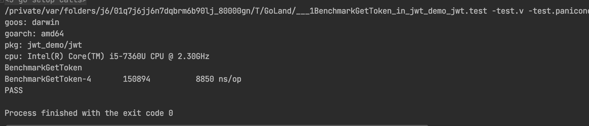
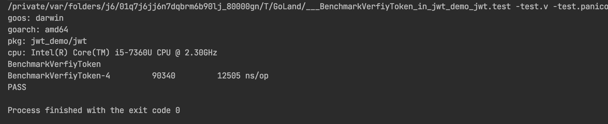
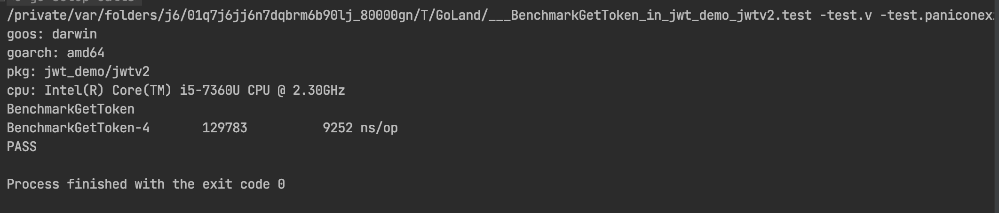
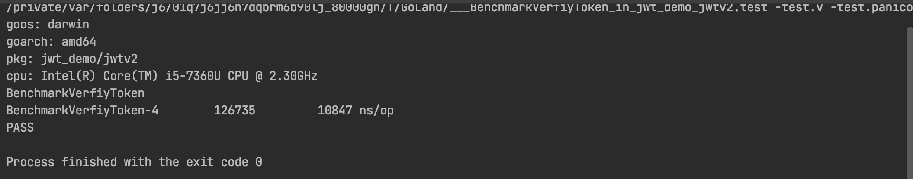
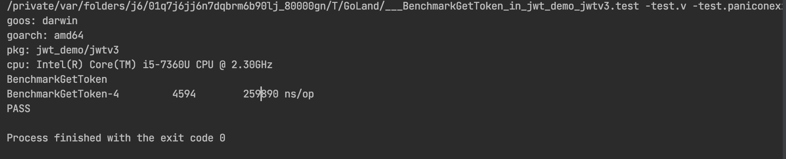
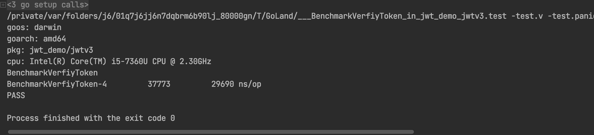
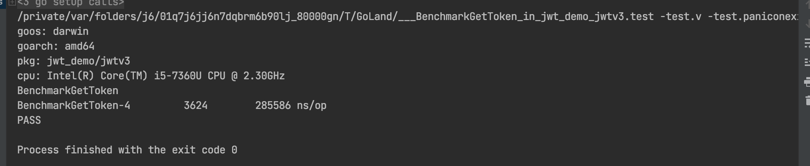
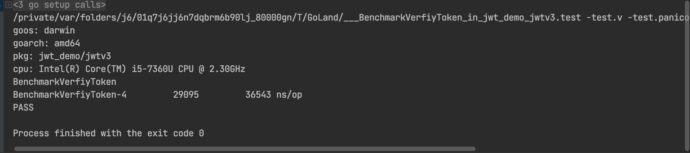
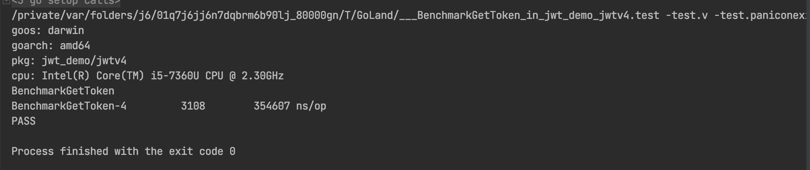
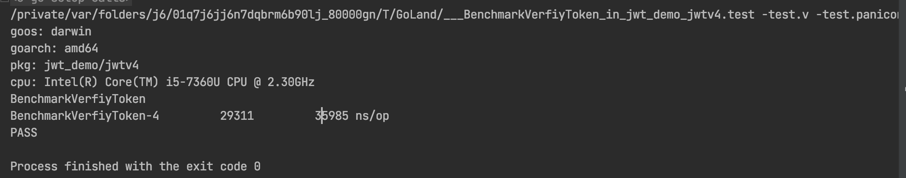

# JWT简介

   JSON Web Token （JWT） 遵循了开放标准协议（RFC7519）。它定义了一种紧凑且允许我们使用JWT在用户和服务器之间传递安全可靠的消息。JWT可以使用secret（HMAC加密算法）或者public/private key（RSA or ECDSA）。

   虽然JWT可以被加密以在各方之间提供保密性，但我们将重点关注签名令牌。签名令牌可以验证其中包含的声明的完整性，而加密令牌会对其他方隐藏这些声明。当使用公钥/私钥对令牌进行签名时，签名还证明只有持有私钥的一方才是签名方。

## 适用场景

- Authorization
- Infomation Exchange

## JWT 结构

JWT通过“.”分成了三个部分，分别是：

- Header
- Payload
- Signature

因此，一个JWT的格式如下：

xxxxxx.yyyyyy.zzzzzzz

### Header

header 包含两部分，token的类型，通常都是JWT，使用的签名方式，如HMAC，SHA256 or RSA.

ex：

```
Header: map[string]interface{}{
 "typ": "JWT",
 "alg": method.Alg(),
}
```

### Payload

Payload中包含了claims。

- registered claims: issuer、 expiration time、subject、audience...
- public claims
- private claims

注：

对于已签名的token，此信息居然受到保护以防止篡改，但任何人都可以读取。除非已加密，否则请勿将机密信息放入 JWT 的有效负载或标头元素中。

### Sign

Sign 用于验证消息在传输过程中有没有被更改，并且在使用private key 签名的token中可以验证token的生成方。


# 当前方案

> ```
> func (j *Jwt) GetToken(data interface{}, key string) string {
>  header := map[string]interface{}{
>  "alg":  "sha256",
>  "type": "jwt",
>  }
>  partOne := j.Encrypt(header)
>  partTwo := j.Encrypt(data)
>  partThree := utils.HashHmac(sha256.New, partOne+"."+partTwo, key)
> 
>  return partOne + "." + partTwo + "." + partThree
> }
> ```

当前方案使用HMAC-sha256算法。


# 存在的问题

1、伪造token，目前采用的secret过于简单，容易被暴力破解。

2、payload相当于明文，不适用于传递敏感信息。

3、token长度过长，目前生成的token长度基本都在450个字节以上。

经测试， sha256 生成的签名恒为64长度。RSA由加密字符串决定。

# 解决方案

- 增加现有key的复杂度。(升级代价最小)
- 动态生成key

需要约定一个生成key的协议，如 md5(app_key + app_id + expire + secret)。

带来问题：1.过度耦合。依赖于业务的数据接口 2.旧key生成的token置换问题

- 生成token和验证token引入gzip，解压缩token，降低token的长度
- 引入AES、RSA等非对称加密方法，加密敏感信息
- 自定义一套协议。

当前JWT方案benchmark：

生成token:



验证token:



动态生成secret方案：

生成token:



验证token：



GZIP方案：

字符串长度减少10-20% 

生成token：


解析token：


zlib方案：

字符串长度减少10-20% 

生成token：


验证token:


sign 使用RSA256 加密方案(使用github.com/golang-jwt/jwt)：

生成token：


验证token:



总结：

| 方案           | 生成token    | 验证token   | 备注                                                         |
| :------------- | :----------- | :---------- | :----------------------------------------------------------- |
| HMAC-sha256    | 9000 ns/op   | 12500 ns/op |                                                              |
| 动态生成secret | 9000 ns/op   | 11000 ns/op | secret 生成规则:md5(json_encode(claims) + secret)            |
| GZIP 压缩      | 260000 ns/op | 30000 ns/op | token长度降低10%-20%                                         |
| zlib 压缩      | 290000 ns/op | 30000 ns/op | token长度降低15%-25%                                         |
| RSA256         | 350000 ns/op | 36000 ns/op | 使用[github.com/golang-jwt/jwt](http://github.com/golang-jwt/jwt) |

从性能上来讲动态生成secret是最优的方案，安全性也相对于现有方法提升很多。从token容量来讲可以引入字符串压缩算法对原始数据先压缩在encode。但生成token会有30倍性能差距，验证token会有3倍的差距。

RSA加密是安全性最高的一种方案，但是性能损耗也比较大。

## ref

JWT: [https://jwt.io](https://jwt.io/)

GZIP: https://blog.csdn.net/imquestion/article/details/16439