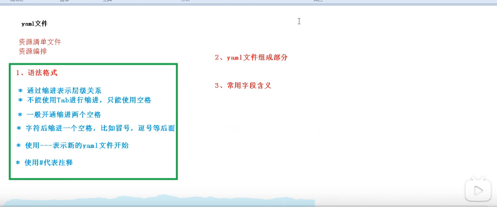

# 资源编排（yaml）

# Pod
Pod是k8s的最小单元。同一个controller中会有一个pause，同一个controller会共享pause的网络。
## Pod控制器类型

- RC 用来确保容器应用的副本数始终保持在用户定义的副本数。
- RS 跟RC没有本质不同，并且支持集合式selector
- 一般建议使用Deployment来自动管理RS，这样就无需担心跟其他机制的不兼容问题。（如RS不支持rolling-update 但deploymen支持）

## Pod 镜像拉取策略

## 资源限制

## Pod重启策略

https://www.bilibili.com/video/BV1GT4y1A756?p=24