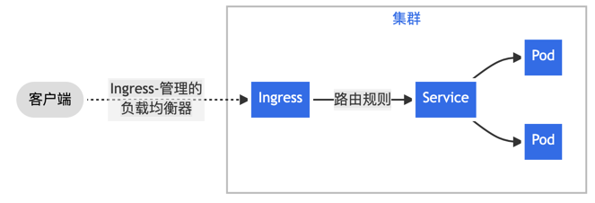

# Ingress
Ingress 是对集群中服务的外部访问进行管理的 API 对象，典型的访问方式是 HTTP。

Ingress 可以提供负载均衡、SSL 终结和基于名称的虚拟托管。

## 术语
- 节点（Node）: Kubernetes 集群中的一台工作机器，是集群的一部分。
- 集群（Cluster）: 一组运行由 Kubernetes 管理的容器化应用程序的节点。 在此示例和在大多数常见的 Kubernetes 部署环境中，集群中的节点都不在公共网络中。
- 边缘路由器（Edge router）: 一组负责将流量从集群外部路由到集群内部的组件。 在此示例中，它们是运行在集群外部的负载均衡器。
- 集群网络（Cluster network）: 一组用于容器和集群节点之间的通信的网络。 在此示例中，它们是运行在集群内部的 Pod 网络。
- 服务（Service）: 一种抽象，定义了一组逻辑上的被选中的 Pod，以及访问它们的策略。 在此示例中，服务是公开 HTTP 和 HTTPS 路由的 Kubernetes Service 资源。

## Ingress 是什么？
Ingress 公开从集群外部到集群内服务的 HTTP 和 HTTPS 路由。 流量路由由 Ingress 资源上定义的规则控制。
下面是一个将所有流量都发送到同一 Service 的简单 Ingress 示例：

Ingress 可为 Service 提供外部可访问的 URL、负载均衡流量、终止 SSL/TLS，以及基于名称的虚拟托管。 Ingress 控制器 通常负责通过负载均衡器来实现 Ingress，尽管它也可以配置边缘路由器或其他前端来帮助处理流量。

