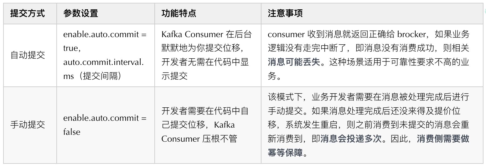
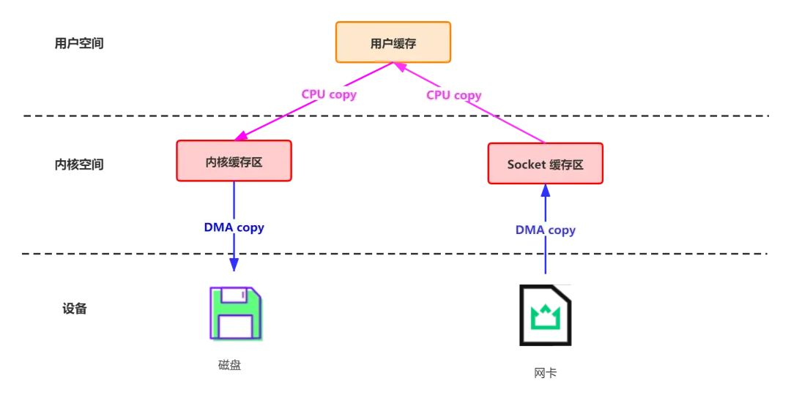

# Kafka 高可靠高性能原理探究
[原文链接](https://mp.weixin.qq.com/s/_g11mmmQse6KrkUE8x4abQ)
## 序章
在探究Kafka核心知识之前，我们先思考一个问题：*什么场景会促使我们使用Kafka？*说到这里，我们的头脑中或多或少会蹦出异步解耦和削峰填谷等字样，是的，这就是 Kafka 最重要的落地场景。
- *异步解耦*：同步调用转换成异步消息通知，实现生产者和消费者的解耦。想象一个场景，在商品交易时，在订单创建完成之后，需要触发一系列其他的操作，比如进行用户订单数据的统计、给用户发送短信、给用户发送邮件等等。如果所有操作都采用同步方式实现，将严重影响系统性能。针对此场景，我们可以利用消息中间件解耦订单创建操作和其他后续行为。
- *削峰填谷*：利用 broker 缓冲上游生产者瞬时突发的流量，使消费者消费流量整体平滑。对于发送能力很强的上游系统，如果没有消息中间件的保护，下游系统可能会直接被压垮导致全链路服务雪崩。想象秒杀业务场景，上游业务发起下单请求，下游业务执行秒杀业务（库存检查，库存冻结，余额冻结，生成订单等等），下游业务处理的逻辑是相当复杂的，并发能力有限，如果上游服务不做限流策略，瞬时可能把下游服务压垮。针对此场景，我们可以利用 MQ 来做削峰填谷，让高峰流量填充低谷空闲资源，达到系统资源的合理利用。

## Kafka的宏观认知
在探究 Kafka 的高性能、高可靠性之前，我们从宏观上来看下 Kafka 的系统架构：

### Kafka 名词
- Producer：生产者，负责消息的创建并通过一定的路由策略发送消息到合适的 Broker；
- Broker：服务实例，负责消息的持久化、中转等功能；
- Consumer ：消费者，负责从 Broker 中拉取（Pull）订阅的消息并进行消费，通常多个消费者构成一个分组，消息只能被同组中的一个消费者消费；
- ZooKeeper：负责 broker、consumer 集群元数据的管理等；（注意：Producer 端直接连接 broker，不在 zk 上存任何数据，只是通过 ZK 监听 broker 和 topic 等信息）
- topic：消息主题。Kafka 按 topic 对消息进行分类，我们在收发消息时只需指定 topic。
- partition：分区。为了提升系统的吞吐，一个 topic 下通常有多个 partition，partition 分布在不同的 Broker 上，用于存储 topic 的消息，这使 Kafka 可以在多台机器上处理、存储消息，给 kafka 提供给了并行的消息处理能力和横向扩容能力。另外，为了提升系统的可靠性，partition 通常会分组，且每组有一个主 partition、多个副本 partition，且分布在不同的 broker 上，从而起到容灾的作用。
- segment：分段。宏观上看，一个 partition 对应一个日志（Log）。由于生产者生产的消息会不断追加到 log 文件末尾，为防止 log 文件过大导致数据检索效率低下，Kafka 采取了分段和索引机制，将每个 partition 分为多个 segment，同时也便于消息的维护和清理。每个 segment 包含一个.log 日志文件、两个索引(.index、timeindex)文件以及其他可能的文件。每个 Segment 的数据文件以该段中最小的 offset 为文件名，当查找 offset 的 Message 的时候，通过二分查找快找到 Message 所处于的 Segment 中。
- offset：消息在日志中的位置，消息在被追加到分区日志文件的时候都会分配一个特定的偏移量。offset 是消息在分区中的唯一标识，是一个单调递增且不变的值。Kafka 通过它来保证消息在分区内的顺序性，不过 offset 并不跨越分区，也就是说，Kafka 保证的是分区有序而不是主题有序。

## kafka高可靠性、高性能探究
在对 Kafka 的整体系统框架及相关概念简单了解后，下面我们来进一步深入探讨下高可靠性、高性能实现原理。
## Kafka 高可靠性探究
Kafka 高可靠性的核心是保证消息在传递过程中不丢失，涉及如下核心环节：
- 消息从生产者可靠地发送至 Broker；-- 网络、本地丢数据；
- 发送到 Broker 的消息可靠持久化；-- Pagecache 缓存落盘、单点崩溃、主从同步跨网络；
- 消费者从 Broker 消费到消息且最好只消费一次 -- 跨网络消息传输 。
消息从生产者可靠地发送至 Broker
为了保障消息从生产者可靠地发送至 Broker，我们需要确保两点；
- Producer 发送消息后，能够收到来自 Broker 的消息保存成功 ack；
- Producer 发送消息后，能够捕获超时、失败 ack 等异常 ack 并做处理。 
ack 策略
- Request.required.acks = 0：请求发送即认为成功，不关心有没有写成功，常用于日志进行分析场景；
- Request.required.acks = 1：当 leader partition 写入成功以后，才算写入成功，有丢数据的可能；
- Request.required.acks= -1：ISR 列表里面的所有副本都写完以后，这条消息才算写入成功，强可靠性保证；
  为了实现强可靠的 kafka 系统，我们需要设置 Request.required.acks= -1，同时还会设置集群中处于正常同步状态的副本 follower 数量 min.insync.replicas>2，另外，设置 unclean.leader.election.enable=false 使得集群中 ISR 的 follower 才可变成新的 leader，避免特殊情况下消息截断的出现。
### 消息发送策略
针对问题 2，kafka 提供两类消息发送方式：同步（sync）发送和异步（async）发送，相关参数如下：

以 sarama 实现为例，在消息发送的过程中，无论是同步发送还是异步发送都会涉及到两个协程--负责消息发送的主协程和负责消息分发的 dispatcher 协程。

### 异步发送
对于异步发送(ack != 0 场景，等于 0 时不关心写 kafka 结果，后文详细讲解)而言，其流程大概如下：

1、在主协程中调用异步发送 kafka 消息的时候，其本质是将消息体放进了一个 input 的 channel，只要入 channel 成功，则这个函数直接返回，不会产生任何阻塞。相反，如果入 channel 失败，则会返回错误信息。因此调用 async 写入的时候返回的错误信息是入 channel 的错误信息，至于具体最终消息有没有发送到 kafka 的 broker，我们无法从返回值得知。

2、当消息进入 input 的 channel 后，会有另一个dispatcher 的协程负责遍历 input，来真正发送消息到特定 Broker 上的主 Partition 上。发送结果通过一个异步协程进行监听，循环处理 err channel 和 success channel，出现了 error 就记一个日志。因此异步写入场景时，写 kafka 的错误信息，我们暂时仅能够从这个错误日志来得知具体发生了什么错，并且也不支持我们自建函数进行兜底处理，这一点在 trpc-go 的官方也得到了承认。

### 同步发送
同步发送(ack != 0 场景)是在异步发送的基础上加以条件限制实现的。同步消息发送在 newSyncProducerFromAsyncProducer 中开启两个异步协程处理消息成功与失败的“回调”，并使用 waitGroup 进行等待，从而将异步操作转变为同步操作，其流程大概如下：

通过上述分析可以发现，kafka 消息发送本质上都是异步的，不过同步发送通过 waitGroup 将异步操作转变为同步操作。同步发送在一定程度上确保了我们在跨网络向 Broker 传输消息时，消息一定可以可靠地传输到 Broker。因为在同步发送场景我们可以明确感知消息是否发送至 Broker，若因网络抖动、机器宕机等故障导致消息发送失败或结果不明，可通过重试等手段确保消息至少一次（at least once） 发送到 Broker。另外，Kafka（0.11.0.0 版本后）还为 Producer 提供两种机制来实现精确一次（exactly once） 消息发送：幂等性（Idempotence）和事务（Transaction）。

## 小结
通过 ack 策略配置、同步发送、事务消息组合能力，我们可以实现exactly once 语意跨网络向 Broker 传输消息。但是，Producer 收到 Broker 的成功 ack，消息一定不会丢失吗？为了搞清这个问题，我们首先要搞明白 Broker 在接收到消息后做了哪些处理。
### 发送到Broker的消息可靠持久化
为了确保 Producer 收到 Broker 的成功 ack 后，消息一定不在 Broker 环节丢失，我们核心要关注以下几点：
- Broker 返回 Producer 成功 ack 时，消息是否已经落盘；
- Broker 宕机是否会导致数据丢失，容灾机制是什么；
- Replica 副本机制带来的多副本间数据同步一致性问题如何解决；
### Broker 异步刷盘机制
kafka 为了获得更高吞吐，Broker 接收到消息后只是将数据写入 PageCache 后便认为消息已写入成功，而 PageCache 中的数据通过 linux 的 flusher 程序进行异步刷盘（刷盘触发条：主动调用 sync 或 fsync 函数、可用内存低于阀值、dirty data 时间达到阀值），将数据顺序写到磁盘。消息处理示意图如下：

由于消息是写入到 pageCache，单机场景，如果还没刷盘 Broker 就宕机了，那么 Producer 产生的这部分数据就可能丢失。为了解决单机故障可能带来的数据丢失问题，Kafka 为分区引入了副本机制。

### Replica 副本机制
Kafka 每组分区通常有多个副本，同组分区的不同副本分布在不同的 Broker 上，保存相同的消息(可能有滞后)。副本之间是“一主多从”的关系，其中 leader 副本负责处理读写请求，follower 副本负责从 leader 拉取消息进行同步。分区的所有副本统称为 AR（Assigned Replicas），其中所有与 leader 副本保持一定同步的副本（包括 leader 副本在内）组成 ISR（In-Sync Replicas），与 leader 同步滞后过多的副本组成 OSR（Out-of-Sync Replicas），由此可见，AR=ISR+OSR。

follower 副本是否与 leader 同步的判断标准取决于 Broker 端参数 replica.lag.time.max.ms(默认为 10 秒)，follower 默认每隔 500ms 向 leader fetch 一次数据，只要一个 Follower 副本落后 Leader 副本的时间不连续超过 10 秒，那么 Kafka 就认为该 Follower 副本与 leader 是同步的。在正常情况下，所有的 follower 副本都应该与 leader 副本保持一定程度的同步，即 AR=ISR，OSR 集合为空。

当 leader 副本所在 Broker 宕机时，Kafka 会借助 ZK 从 follower 副本中选举新的 leader 继续对外提供服务，实现故障的自动转移，保证服务可用。为了使选举的新 leader 和旧 leader 数据尽可能一致，当 leader 副本发生故障时，默认情况下只有在 ISR 集合中的副本才有资格被选举为新的 leader，而在 OSR 集合中的副本则没有任何机会（可通过设置 unclean.leader.election.enable 改变）。

当 Kafka 通过多副本机制解决单机故障问题时，同时也带来了多副本间数据同步一致性问题。Kafka 通过高水位更新机制、副本同步机制、 Leader Epoch 等多种措施解决了多副本间数据同步一致性问题，下面我们来依次看下这几大措施。

### HW 和 LEO
首先，我们来看下两个和 Kafka 中日志相关的重要概念 HW 和 LEO：
- HW: High Watermark，高水位，表示已经提交(commit)的最大日志偏移量，Kafka 中某条日志“已提交”的意思是 ISR 中所有节点都包含了此条日志，并且消费者只能消费 HW 之前的数据；
- LEO: Log End Offset，表示当前 log 文件中下一条待写入消息的 offset；

如上图所示，它代表一个日志文件，这个日志文件中有 8 条消息，0 至 5 之间的消息为已提交消息，5 至 7 的消息为未提交消息。日志文件的 HW 为 6，表示消费者只能拉取到 5 之前的消息，而 offset 为 5 的消息对消费者而言是不可见的。日志文件的 LEO 为 8，下一条消息将在此处写入。

注意：所有副本都有对应的 HW 和 LEO，只不过 Leader 副本比较特殊，Kafka 使用 Leader 副本的高水位来定义所在分区的高水位。换句话说，分区的高水位就是其 Leader 副本的高水位。Leader 副本和 Follower 副本的 HW 有如下特点：

- Leader HW：min（所有副本 LEO），为此 Leader 副本不仅要保存自己的 HW 和 LEO，还要保存 follower 副本的 HW 和 LEO，而 follower 副本只需保存自己的 HW 和 LEO；
- Follower HW：min(follower 自身 LEO，leader HW)。

注意：为方便描述，下面Leader HW简记为HWL，Follower HW简记为F，Leader LEO简记为LEOL ，Follower LEO简记为LEOF。

下面我们演示一次完整的 HW / LEO 更新流程：

1、初始状态
HWL=0，LEOL=0，HWF=0，LEOF=0。

2、Follower 第一次 fetch
- Leader收到Producer发来的一条消息完成存储, 更新LEOL=1;
- Follower从Leader fetch数据,  Leader收到请求，记录follower的LEOF =0，并且尝试更新HWL =min(全部副本LEO)=0；
- leader返回HWL=0和LEOL=1给Follower，Follower存储消息并更新LEOF =1, HW=min(LEOF，HWL)=0。

3、Follower 第二次 fetch
- Follower再次从Leader fetch数据,  Leader收到请求，记录follower的LEOF =1，并且尝试更新HWL =min(全部副本LEO)=1；
- leader返回HWL=1和LEOL=1给Follower，Leader收到请求，更新自己的 HW=min(LEOF，HWL)=1。
  上述更新流程中 Follower 和 Leader 的 HW 更新有时间 GAP。如果 Leader 节点在此期间发生故障，则 Follower 的 HW 和 Leader 的 HW 可能会处于不一致状态，如果 Followe 被选为新的 Leader 并且以自己的 HW 为准对外提供服务，则可能带来数据丢失或数据错乱问题。

### KIP-101 问题：数据丢失&数据错乱 ^参 5^
#### 数据丢失

第 1 步:

1、副本 B 作为 leader 收到 producer 的 m2 消息并写入本地文件，等待副本 A 拉取。

2、副本 A 发起消息拉取请求，请求中携带自己的最新的日志 offset（LEO=1），B 收到后更新自己的 HW 为 1，并将 HW=1 的信息以及消息 m2 返回给 A。

3、A 收到拉取结果后更新本地的 HW 为 1，并将 m2 写入本地文件。发起新一轮拉取请求（LEO=2），B 收到 A 拉取请求后更新自己的 HW 为 2，没有新数据只将 HW=2 的信息返回给 A，并且回复给 producer 写入成功。此处的状态就是图中第一步的状态。

第 2 步：

此时，如果没有异常，A 会收到 B 的回复，得知目前的 HW 为 2，然后更新自身的 HW 为 2。但在此时 A 重启了，没有来得及收到 B 的回复，此时 B 仍然是 leader。A 重启之后会以 HW 为标准截断自己的日志，因为 A 作为 follower 不知道多出的日志是否是被提交过的，防止数据不一致从而截断多余的数据并尝试从 leader 那里重新同步。

第 3 步：

B 崩溃了，min.isr 设置的是 1，所以 zookeeper 会从 ISR 中再选择一个作为 leader，也就是 A，但是 A 的数据不是完整的，从而出现了数据丢失现象。

问题在哪里？在于 A 重启之后以 HW 为标准截断了多余的日志。不截断行不行？不行，因为这个日志可能没被提交过（也就是没有被 ISR 中的所有节点写入过），如果保留会导致日志错乱。

#### 数据错乱

在分析日志错乱的问题之前，我们需要了解到 kafka 的副本可靠性保证有一个前提：在 ISR 中至少有一个节点。如果节点均宕机的情况下，是不保证可靠性的，在这种情况会出现数据丢失，数据丢失是可接受的。这里我们分析的问题比数据丢失更加槽糕，会引发日志错乱甚至导致整个系统异常，而这是不可接受的。

第 1 步：

1、A 和 B 均为 ISR 中的节点。副本 A 作为 leader，收到 producer 的消息 m2 的请求后写入 PageCache 并在某个时刻刷新到本地磁盘。

2、副本 B 拉取到 m2 后写入 PageCage 后（尚未刷盘）再次去 A 中拉取新消息并告知 A 自己的 LEO=2，A 收到更新自己的 HW 为 1 并回复给 producer 成功。

3、此时 A 和 B 同时宕机，B 的 m2 由于尚未刷盘，所以 m2 消息丢失。此时的状态就是第 1 步的状态。

第 2 步：

由于 A 和 B 均宕机，而 min.isr=1 并且 unclean.leader.election.enable=true（关闭 unclean 选择策略），所以 Kafka 会等到第一个 ISR 中的节点恢复并选为 leader，这里不幸的是 B 被选为 leader，而且还接收到 producer 发来的新消息 m3。注意，这里丢失 m2 消息是可接受的，毕竟所有节点都宕机了。

第 3 步：

A 恢复重启后发现自己是 follower，而且 HW 为 2，并没有多余的数据需要截断，所以开始和 B 进行新一轮的同步。但此时 A 和 B 均没有意识到，offset 为 1 的消息不一致了。

问题在哪里？在于日志的写入是异步的，上面也提到 Kafka 的副本策略的一个设计是消息的持久化是异步的，这就会导致在场景二的情况下被选出的 leader 不一定包含所有数据，从而引发日志错乱的问题。

#### Leader Epoch
为了解决上述缺陷，Kafka 引入了 Leader Epoch 的概念。leader epoch 和 raft 中的任期号的概念很类似，每次重新选择 leader 的时候，用一个严格单调递增的 id 来标志，可以让所有 follower 意识到 leader 的变化。而 follower 也不再以 HW 为准，每次奔溃重启后都需要去 leader 那边确认下当前 leader 的日志是从哪个 offset 开始的。下面看下 Leader Epoch 是如何解决上面两个问题的。

#### 数据丢失解决

这里的关键点在于副本 A 重启后作为 follower，不是忙着以 HW 为准截断自己的日志，而是先发起 LeaderEpochRequest 询问副本 B 第 0 代的最新的偏移量是多少，副本 B 会返回自己的 LEO 为 2 给副本 A，A 此时就知道消息 m2 不能被截断，所以 m2 得到了保留。当 A 选为 leader 的时候就保留了所有已提交的日志，日志丢失的问题得到解决。

如果发起 LeaderEpochRequest 的时候就已经挂了怎么办？这种场景下，不会出现日志丢失，因为副本 A 被选为 leader 后不会截断自己的日志，日志截断只会发生在 follower 身上。

#### 数据错乱解决

这里的关键点还是在第 3 步，副本 A 重启作为 follower 的第一步还是需要发起 LeaderEpochRequest 询问 leader 当前第 0 代最新的偏移量是多少，由于副本 B 已经经过换代，所以会返回给 A 第 1 代的起始偏移（也就是 1），A 发现冲突后会截断自己偏移量为 1 的日志，并重新开始和 leader 同步。副本 A 和副本 B 的日志达到了一致，解决了日志错乱。

### 小结
Broker 接收到消息后只是将数据写入 PageCache 后便认为消息已写入成功，但是，通过副本机制并结合 ACK 策略可以大概率规避单机宕机带来的数据丢失问题，并通过 HW、副本同步机制、 Leader Epoch 等多种措施解决了多副本间数据同步一致性问题，最终实现了 Broker 数据的可靠持久化。

### 消费者从 Broker 消费到消息且最好只消费一次
Consumer 在消费消息的过程中需要向 Kafka 汇报自己的位移数据，只有当 Consumer 向 Kafka 汇报了消息位移，该条消息才会被 Broker 认为已经被消费。因此，Consumer 端消息的可靠性主要和 offset 提交方式有关，Kafka 消费端提供了两种消息提交方式：

正常情况下我们很难实现 exactly once 语意的消息，通常是通过手动提交+幂等实现消息的可靠消费。

## Kafka 高性能探究
Kafka 高性能的核心是保障系统低延迟、高吞吐地处理消息，为此，Kafka 采用了许多精妙的设计：
- 异步发送
- 批量发送
- 压缩技术
- Pagecache 机制&顺序追加落盘
- 零拷贝
- 稀疏索引
- broker & 数据分区
- 多 reactor 多线程网络模型

### 异步发送
如上文所述，Kafka 提供了异步和同步两种消息发送方式。在异步发送中，整个流程都是异步的。调用异步发送方法后，消息会被写入 channel，然后立即返回成功。Dispatcher 协程会从 channel 轮询消息，将其发送到 Broker，同时会有另一个异步协程负责处理 Broker 返回的结果。同步发送本质上也是异步的，但是在处理结果时，同步发送通过 waitGroup 将异步操作转换为同步。使用异步发送可以最大化提高消息发送的吞吐能力。

### 批量发送
Kafka 支持批量发送消息，将多个消息打包成一个批次进行发送，从而减少网络传输的开销，提高网络传输的效率和吞吐量。Kafka 的批量发送消息是通过以下两个参数来控制的：

- batch.size：控制批量发送消息的大小，默认值为 16KB，可适当增加 batch.size 参数值提升吞吐。但是，需要注意的是，如果批量发送的大小设置得过大，可能会导致消息发送的延迟增加，因此需要根据实际情况进行调整。
- linger.ms：控制消息在批量发送前的等待时间，默认值为 0。当 linger.ms 大于 0 时，如果有消息发送，Kafka 会等待指定的时间，如果等待时间到达或者批量大小达到 batch.size，就会将消息打包成一个批次进行发送。可适当增加 linger.ms 参数值提升吞吐，比如 10 ～ 100。
  在 Kafka 的生产者客户端中，当发送消息时，如果启用了批量发送，Kafka 会将消息缓存到缓冲区中。当缓冲区中的消息大小达到 batch.size 或者等待时间到达 linger.ms 时，Kafka 会将缓冲区中的消息打包成一个批次进行发送。如果在等待时间内没有达到 batch.size，Kafka 也会将缓冲区中的消息发送出去，从而避免消息积压。

### 压缩技术
Kafka 支持压缩技术，通过将消息进行压缩后再进行传输，从而减少网络传输的开销(压缩和解压缩的过程会消耗一定的 CPU 资源，因此需要根据实际情况进行调整。)，提高网络传输的效率和吞吐量。Kafka 支持多种压缩算法，在 Kafka2.1.0 版本之前，仅支持 GZIP，Snappy 和 LZ4，2.1.0 后还支持 Zstandard 算法（Facebook 开源，能够提供超高压缩比）。这些压缩算法性能对比（两指标都是越高越好）如下：

- 吞吐量：LZ4>Snappy>zstd 和 GZIP，压缩比：zstd>LZ4>GZIP>Snappy。
  在 Kafka 中，压缩技术是通过以下两个参数来控制的：
- compression.type：控制压缩算法的类型，默认值为 none，表示不进行压缩。
- compression.level：控制压缩的级别，取值范围为 0-9，默认值为-1。当值为-1 时，表示使用默认的压缩级别。

在 Kafka 的生产者客户端中，当发送消息时，如果启用了压缩技术，Kafka 会将消息进行压缩后再进行传输。在消费者客户端中，如果消息进行了压缩，Kafka 会在消费消息时将其解压缩。注意：Broker 如果设置了和生产者不通的压缩算法，接收消息后会解压后重新压缩保存。Broker 如果存在消息版本兼容也会触发解压后再压缩。

### Pagecache 机制&顺序追加落盘
kafka 为了提升系统吞吐、降低时延，Broker 接收到消息后只是将数据写入PageCache后便认为消息已写入成功，而 PageCache 中的数据通过 linux 的 flusher 程序进行异步刷盘（避免了同步刷盘的巨大系统开销），将数据顺序追加写到磁盘日志文件中。由于 pagecache 是在内存中进行缓存，因此读写速度非常快，可以大大提高读写效率。顺序追加写充分利用顺序 I/O 写操作，避免了缓慢的随机 I/O 操作，可有效提升 Kafka 吞吐。

如上图所示，消息被顺序追加到每个分区日志文件的尾部。

### 零拷贝
Kafka 中存在大量的网络数据持久化到磁盘（Producer 到 Broker）和磁盘文件通过网络发送（Broker 到 Consumer）的过程，这一过程的性能直接影响 Kafka 的整体吞吐量。传统的 IO 操作存在多次数据拷贝和上下文切换，性能比较低。Kafka 利用零拷贝技术提升上述过程性能，其中网络数据持久化磁盘主要用 mmap 技术，网络数据传输环节主要使用 sendfile 技术。

#### 索引加速之 mmap

传统模式下，数据从网络传输到文件需要 4 次数据拷贝、4 次上下文切换和两次系统调用。如下图所示：

为了减少上下文切换以及数据拷贝带来的性能开销，Kafka使用mmap来处理其索引文件。Kafka中的索引文件用于在提取日志文件中的消息时进行高效查找。这些索引文件被维护为内存映射文件，这允许Kafka快速访问和搜索内存中的索引，从而加速在日志文件中定位消息的过程。mmap 将内核中读缓冲区（read buffer）的地址与用户空间的缓冲区（user buffer）进行映射，从而实现内核缓冲区与应用程序内存的共享，省去了将数据从内核读缓冲区（read buffer）拷贝到用户缓冲区（user buffer）的过程，整个拷贝过程会发生 4 次上下文切换，1 次CPU 拷贝和 2次 DMA 拷贝。

#### 网络数据传输之 sendfile

传统方式实现：先读取磁盘、再用 socket 发送，实际也是进过四次 copy。如下图所示：

为了减少上下文切换以及数据拷贝带来的性能开销，Kafka 在 Consumer 从 Broker 读数据过程中使用了 sendfile 技术。具体在这里采用的方案是通过 NIO 的 transferTo/transferFrom 调用操作系统的 sendfile 实现零拷贝。总共发生 2 次内核数据拷贝、2 次上下文切换和一次系统调用，消除了 CPU 数据拷贝，如下：

#### 稀疏索引

为了方便对日志进行检索和过期清理，kafka 日志文件除了有用于存储日志的.log 文件，还有一个位移索引文件.index和一个时间戳索引文件.timeindex 文件，并且三文件的名字完全相同，如下：

Kafka 的索引文件是按照稀疏索引的思想进行设计的。稀疏索引的核心是不会为每个记录都保存索引，而是写入一定的记录之后才会增加一个索引值，具体这个间隔有多大则通过 log.index.interval.bytes 参数进行控制，默认大小为 4 KB，意味着 Kafka 至少写入 4KB 消息数据之后，才会在索引文件中增加一个索引项。可见，单条消息大小会影响 Kakfa 索引的插入频率，因此 log.index.interval.bytes 也是 Kafka 调优一个重要参数值。由于索引文件也是按照消息的顺序性进行增加索引项的，因此 Kafka 可以利用二分查找算法来搜索目标索引项，把时间复杂度降到了 O(lgN)，大大减少了查找的时间。

#### 位移索引文件.index
位移索引文件的索引项结构如下：

相对位移：保存于索引文件名字上面的起始位移的差值，假设一个索引文件为：00000000000000000100.index，那么起始位移值即 100，当存储位移为 150 的消息索引时，在索引文件中的相对位移则为 150 - 100 = 50，这么做的好处是使用 4 字节保存位移即可，可以节省非常多的磁盘空间。

文件物理位置：消息在 log 文件中保存的位置，也就是说 Kafka 可根据消息位移，通过位移索引文件快速找到消息在 log 文件中的物理位置，有了该物理位置的值，我们就可以快速地从 log 文件中找到对应的消息了。下面我用图来表示 Kafka 是如何快速检索消息：

假设 Kafka 需要找出位移为 3550 的消息，那么 Kafka 首先会使用二分查找算法找到小于 3550 的最大索引项：[3528, 2310272]，得到索引项之后，Kafka 会根据该索引项的文件物理位置在 log 文件中从位置 2310272 开始顺序查找，直至找到位移为 3550 的消息记录为止。

#### 时间戳索引文件.timeindex
Kafka 在 0.10.0.0 以后的版本当中，消息中增加了时间戳信息，为了满足用户需要根据时间戳查询消息记录，Kafka 增加了时间戳索引文件，时间戳索引文件的索引项结构如下：

时间戳索引文件的检索与位移索引文件类似，如下快速检索消息示意图：

### broker & 数据分区
Kafka 集群包含多个 broker。一个 topic 下通常有多个 partition，partition 分布在不同的 Broker 上，用于存储 topic 的消息，这使 Kafka 可以在多台机器上处理、存储消息，给 kafka 提供给了并行的消息处理能力和横向扩容能力。
### 多 reactor 多线程网络模型
多 Reactor 多线程网络模型 是一种高效的网络通信模型，可以充分利用多核 CPU 的性能，提高系统的吞吐量和响应速度。Kafka 为了提升系统的吞吐，在 Broker 端处理消息时采用了该模型，示意如下：

SocketServer和KafkaRequestHandlerPool是其中最重要的两个组件：
- SocketServer：实现 Reactor 模式，用于处理多个 Client（包括客户端和其他 broker 节点）的并发请求，并将处理结果返回给 Client
- KafkaRequestHandlerPool：Reactor 模式中的 Worker 线程池，里面定义了多个工作线程，用于处理实际的 I/O 请求逻辑。
#### 整个服务端处理请求的流程大致分为以下几个步骤：
- Acceptor 接收客户端发来的请求
- 轮询分发给 Processor 线程处理
- Processor 将请求封装成 Request 对象，放到 RequestQueue 队列
- KafkaRequestHandlerPool 分配工作线程，处理 RequestQueue 中的请求
- KafkaRequestHandler 线程处理完请求后，将响应 Response 返回给 Processor 线程
- Processor 线程将响应返回给客户端

## 其他知识探究
### 负载均衡
#### 生产者负载均衡
Kafka 生产端的负载均衡主要指如何将消息发送到合适的分区。Kafka 生产者生产消息时，根据分区器将消息投递到指定的分区中，所以 Kafka 的负载均衡很大程度上依赖于分区器。Kafka 默认的分区器是 Kafka 提供的 DefaultPartitioner。它的分区策略是根据 Key 值进行分区分配的：

- 如果 key 不为 null：对 Key 值进行 Hash 计算，从所有分区中根据 Key 的 Hash 值计算出一个分区号；拥有相同 Key 值的消息被写入同一个分区，顺序消息实现的关键；
- 如果 key 为 null：消息将以轮询的方式，在所有可用分区中分别写入消息。如果不想使用 Kafka 默认的分区器，用户可以实现 Partitioner 接口，自行实现分区方法。
#### 消费者负载均衡
在 Kafka 中，每个分区（Partition）只能由一个消费者组中的一个消费者消费。当消费者组中有多个消费者时，Kafka 会自动进行负载均衡，将分区均匀地分配给每个消费者。在 Kafka 中，消费者负载均衡算法可以通过设置消费者组的 partition.assignment.strategy 参数来选择。目前主流的分区分配策略以下几种：

- range: 在保证均衡的前提下，将连续的分区分配给消费者，对应的实现是 RangeAssignor；
- round-robin：在保证均衡的前提下，轮询分配，对应的实现是 RoundRobinAssignor；
- 0.11.0.0 版本引入了一种新的分区分配策略 StickyAssignor，其优势在于能够保证分区均衡的前提下尽量保持原有的分区分配结果，从而避免许多冗余的分区分配操作，减少分区再分配的执行时间。

### 集群管理
Kafka 借助 ZooKeeper 进行集群管理。Kafka 中很多信息都在 ZK 中维护，如 broker 集群信息、consumer 集群信息、 topic 相关信息、 partition 信息等。Kafka 的很多功能也是基于 ZK 实现的，如 partition 选主、broker 集群管理、consumer 负载均衡等，限于篇幅本文将不展开陈述，这里先附一张网上截图大家感受下：

## 参考文献
- https://www.cnblogs.com/arvinhuang/p/16437948.html
- https://segmentfault.com/a/1190000039133960
- http://matt33.com/2018/11/04/kafka-transaction/
- https://blog.51cto.com/u_14020077/5836698
- https://t1mek1ller.github.io/2020/02/15/kafka-leader-epoch/
- https://cwiki.apache.org/confluence/display/KAFKA/KIP-101+-+Alter+Replication+Protocol+to+use+Leader+Epoch+rather+than+High+Watermark+for+Truncation
- https://xie.infoq.cn/article/c06fea629926e2b6a8073e2f0
- https://xie.infoq.cn/article/8191412c8da131e78cbfa6600
- https://mp.weixin.qq.com/s/iEk0loXsKsMO_OCVlUsk2Q
- https://cloud.tencent.com/developer/article/1657649
- https://www.cnblogs.com/vivotech/p/16347074.html

