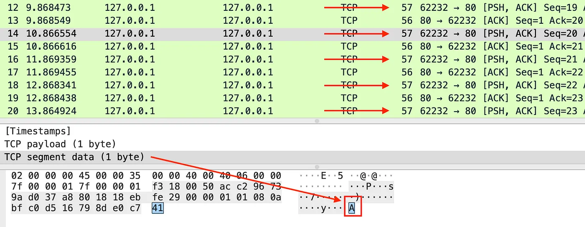
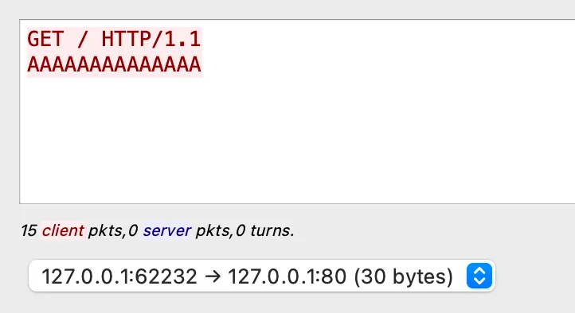
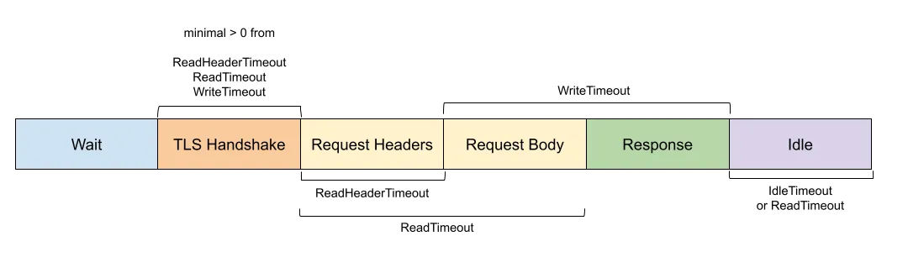

# Go: How to Mitigate RUDY DoS Attack
最近在medium上看到一个topic，叫a-journey-with-go，他的插图还是挺有意思的，内容也比较通俗易懂，就翻译下来一起分享一下。

老规矩，先上[原文链接](https://medium.com/a-journey-with-go/go-how-to-mitigate-rudy-dos-attack-3bd9c1662848)

本文基于Go1.18。

在前一篇文章中，我们讨论了 [Slowloris attack](https://medium.com/a-journey-with-go/go-understand-and-mitigate-slowloris-attack-711c1b1403f6) ーー一种旨在通过保持大量连接开放而使服务器不堪重负的 DoS 攻击ーー以及如何减轻这种攻击。鲁迪(R-U-Dead-yet?)是一种类似的攻击，但是使用请求体以非常慢的速度一字节一字节地发送其内容。让我们深入到一个例子来了解它是如何工作的。

## 什么是RUDY攻击？

对于本文，我将使用 Go 中内置的一个简单 HTTP 服务器和一个简单 Go 客户机，它打开一个 HTTP 连接并逐部推送主体部分的内容。以下是我从 Wireshark.com 上观察到的:

遵循 TCP 流的选项将显示跨多个数据包发送的完整内容:

如果您对客户端实现感兴趣，可以在 GitHub 上找到几个客户端，比如用 Python 编写的 sahilchaddha/rudyjs。

## 影响及缓解措施
R.U.D.Y 攻击的影响与前一篇文章中描述的 Slowloris 相同。持续开放的大量连接最终将达到极限，阻止任何新连接的建立。

默认情况下，Go 没有定义任何可能阻止此行为的特定超时。但是，Go 有一些参数，我们可以配置这些参数来防止发生这种攻击。以下是可供选择的方案:

这里需要配置 ReadTimeout，因为它涵盖 HTTP 请求的头部和主体。