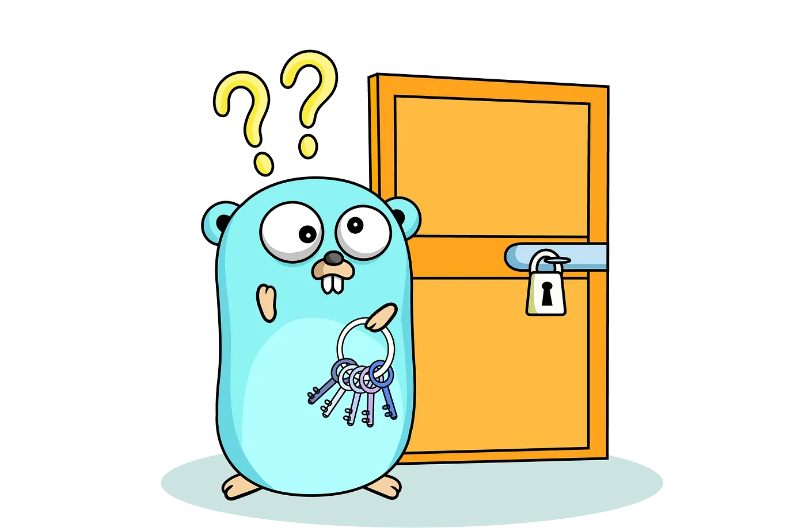
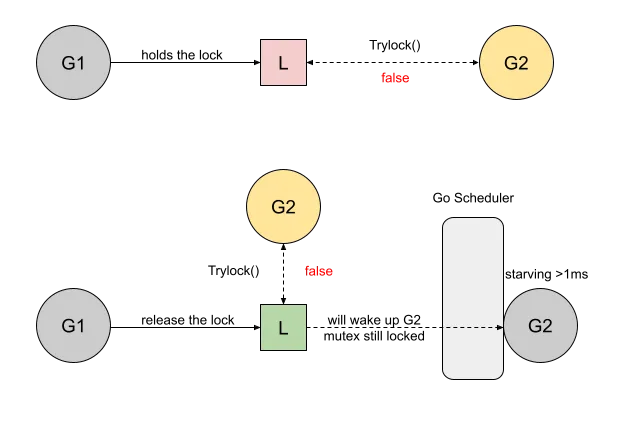

# Go: Story of TryLock Function
最近在medium上看到一个topic，叫a-journey-with-go，他的插图还是挺有意思的，内容也比较通俗易懂，就翻译下来一起分享一下。

老规矩，先上[原文链接](https://medium.com/a-journey-with-go/go-story-of-trylock-function-a69ef6dbb410)



本文基于Go1.18。

Go1.18 带来了一个新的方法[TryLock](https://pkg.go.dev/sync#Mutex.TryLock)（用于sync.Mutex 和 sync.RWMutex），
这个方法允许开发者在不阻塞的情况下尝试获取锁，如果锁已经被其他goroutine持有，那么TryLock会立即返回false。而不是等待锁
被释放。

这个函数激起了我的好奇心，因为尽管它的名称是明确的，但是它的用例并不明显。让我们收集有关它的信息，以便更好地了解它的用法。

## 工作流
为了更好地理解互斥对象的工作流程，我建议您阅读我的文章“ [Go: Mutex and Starvation](https://medium.com/a-journey-with-go/go-mutex-and-starvation-3f4f4e75ad50)”
如果以下情况，则互斥锁不可用:
- 锁现在由另一个 Goroutine 持有。
- 锁没有被持有，但是互斥锁处于饥饿模式; 也就是说，锁将被传递给下一个使用者。

在这两种case中，TryLock 都会返回false，以下是这两种use case的图例。


这是一个相当快的操作，因为它只依赖于单一bit操作。

如果锁是可用的，goroutine 将尝试获取它，就像它获取 Lock 函数一样，并返回此操作的结果。如果它不可用，goroutine 将不会旋转或停放;
它是一个完全非阻塞模式。

## 这个issue解决了什么问题
文档明确指出，使用此函数的情况将是罕见的:
请注意，虽然确实存在TryLock的正确用法，但它们很少，并且TryLock的使用通常是在特定的互斥锁使用中存在更深层次问题的标志。

事实上，多年来(参见2012年的讨论，2013年的讨论，或2013年的其他讨论)，这个特性似乎不需要，甚至不需要解决任何实际问题，前面提到的讨论都没有带来任何实际用例。
那么这个实现可以给社区带来什么呢?实际上,许多…

## 源码实现
最后让我们看下他是如何实现的吧。
```go
    // src/sync/mutex.go
    // TryLock tries to lock m and reports whether it succeeded.
    //
    // Note that while correct uses of TryLock do exist, they are rare,
    // and use of TryLock is often a sign of a deeper problem
    // in a particular use of mutexes.
    func (m *Mutex) TryLock() bool {
        old := m.state
        if old&(mutexLocked|mutexStarving) != 0 {
            return false
        }
    
        // There may be a goroutine waiting for the mutex, but we are
        // running now and can try to grab the mutex before that
        // goroutine wakes up.
        if !atomic.CompareAndSwapInt32(&m.state, old, old|mutexLocked) {
            return false
        }
    
        if race.Enabled {
            race.Acquire(unsafe.Pointer(m))
        }
        return true
    }
```

