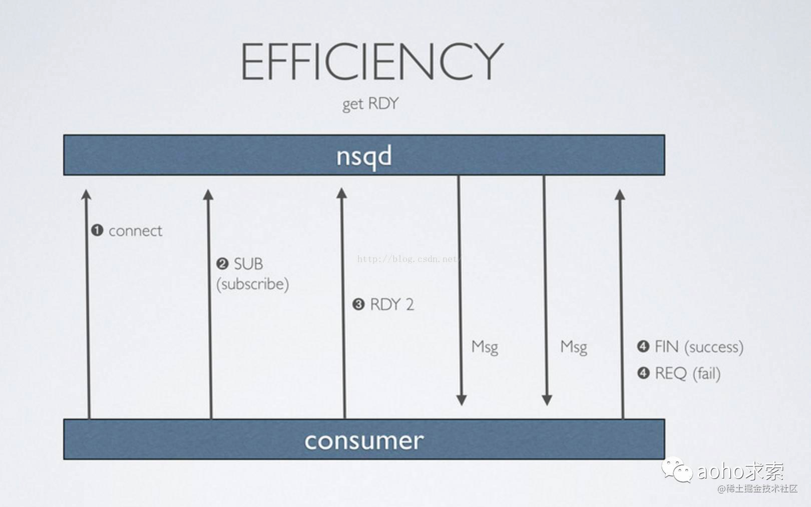

原生NSQ在消息送到达NSQD（NSQ核心服务）服务后会先存储在内存中，当内存中消息累积到一定量后才会落到数据盘中。原生NSQD节点之间无法实现分布式协作，并且单点故障时会出现消息丢失。

- Topic 一个topic就是程序发布消息的一个逻辑键，当程序第一次发布消息时就会创建topic。
- Channels channel与消费者相关，是消费者之间的负载均衡，channel在某种意义上来说是一个“队列”。每当一个发布者发送一条消息到一个topic，消息会被*复制*到所有消费者连接的channel上，消费者通过这个特殊的channel读取消息，实际上，在消费者第一次订阅时就会创建channel。Channel会将消息进行排列，如果没有消费者读取消息，消息首先会在内存中排队，当量太大时就会被保存到磁盘中。
- Messages 消息构成了我们数据流的中坚力量，消费者可以选择结束消息，表明它们正在被正常处理，或者重新将他们排队待到后面再进行处理。每个消息包含传递尝试的次数，当消息传递超过一定的阀值次数时，我们应该放弃这些消息，或者作为额外消息进行处理。
- nsqd nsqd 是一个守护进程，负责接收，排队，投递消息给客户端。它可以独立运行，不过通常它是由 nsqlookupd 实例所在集群配置的（它在这能声明 topics 和 channels，以便大家能找到）。
- nsqlookupd：nsqlookupd是守护进程负责管理拓扑信息。客户端通过查询 nsqlookupd 来发现指定话题（topic）的生产者，并且 nsqd 节点广播话题（topic）和通道（channel）信息。有两个接口：TCP 接口，nsqd 用它来广播。HTTP 接口，客户端用它来发现和管理。 (有赞的分支将这个功能使用etcd实现了)
- nsqadmin：nsqadmin是一套 WEB UI，用来汇集集群的实时统计，并执行不同的管理任务。
- - nsq_to _file：消费指定的话题（topic）/通道（channel），并写到文件中，有选择的滚动和/或压缩文件。
- - nsq_to _http：消费指定的话题（topic）/通道（channel）和执行 HTTP requests (GET/POST) 到指定的端点。
- - nsq_to _nsq：消费者指定的话题/通道和重发布消息到目的地 nsqd 通过 TCP。

每个channel的消息都会进行排队，直到一个worker把他们消费，如果此队列超出了内存限制，消息将会被写入到磁盘中。Nsqd节点首先会向nsqlookup广播他们的位置信息，一旦它们注册成功，worker将会从nsqlookup服务器节点上发现所有包含事件topic的nsqd节点。

### 消息传递担保

NSQ 保证消息将交付至少一次，虽然消息可能是重复的。消费者应该关注到这一点，删除重复数据或执行idempotent等操作。 这个担保是作为协议和工作流的一部分，工作原理如下（假设客户端成功连接并订阅一个Topic）
-  1）客户表示已经准备好接收消息 
-  2）NSQ 发送一条消息，并暂时将数据存储在本地（在 re-queue 或 timeout）
-  3）客户端回复 FIN（结束）或 REQ（重新排队）分别指示成功或失败。如果客户端没有回复, NSQ 会在设定的时间超时，自动重新排队消息
   这确保了消息丢失唯一可能的情况是不正常结束 nsqd 进程。在这种情况下，这是在内存中的任何信息（或任何缓冲未刷新到磁盘）都将丢失。 如何防止消息丢失是最重要的，即使是这个意外情况可以得到缓解。一种解决方案是构成冗余 nsqd对（在不同的主机上）接收消息的相同部分的副本。因为你实现的消费者是幂等的，以两倍时间处理这些消息不会对下游造成影响，并使得系统能够承受任何单一节点故障而不会丢失信息。

### 效率
对于数据的协议，通过推送数据到客户端最大限度地提高性能和吞吐量的，而不是等待客户端拉数据。这个概念，称之为 RDY 状态，基本上是客户端流量控制的一种形式。 当客户端连接到 nsqd 和并订阅到一个通道时，它被放置在一个 RDY 为 0 状态。这意味着，还没有信息被发送到客户端。当客户端已准备好接收消息发送，更新它的命令 RDY 状态到它准备处理的数量，比如 100。无需任何额外的指令，当 100 条消息可用时，将被传递到客户端（服务器端为那个客户端每次递减
RDY 计数）。客户端库的被设计成在 RDY 数达到配置 max-in-flight 的 25% 发送一个命令来更新 RDY 计数（并适当考虑连接到多个 nsqd 情况下，适当地分配）。

通过推送数据到客户端的方式实现提高性能和吞吐量

### 没有提供任何形式的复制和集群

