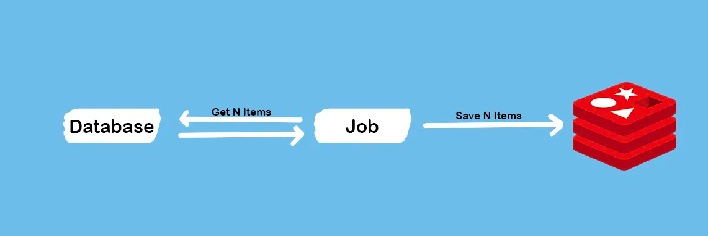
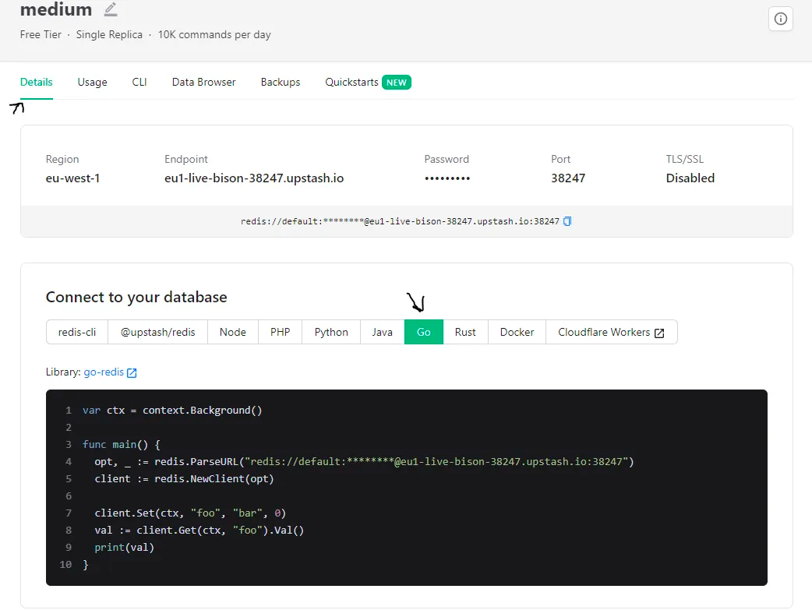
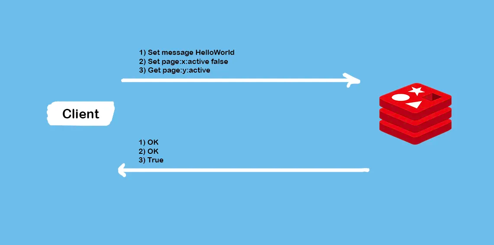
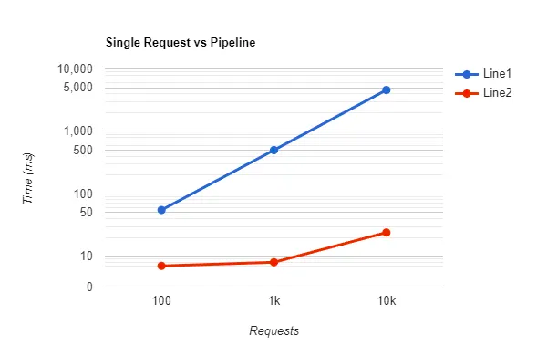
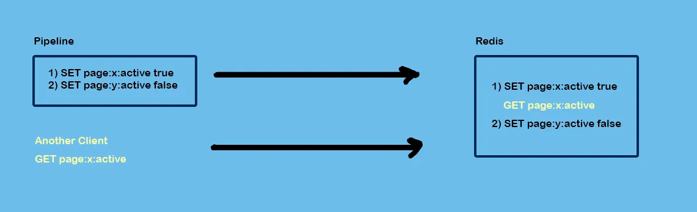
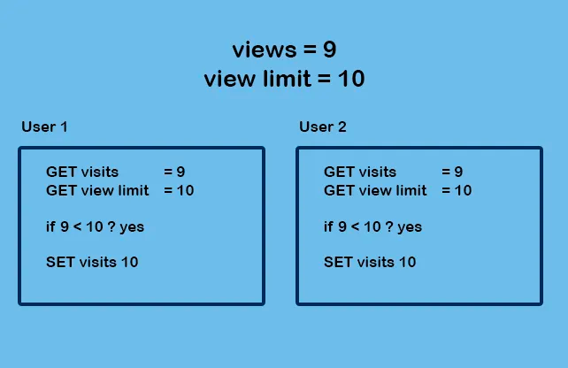
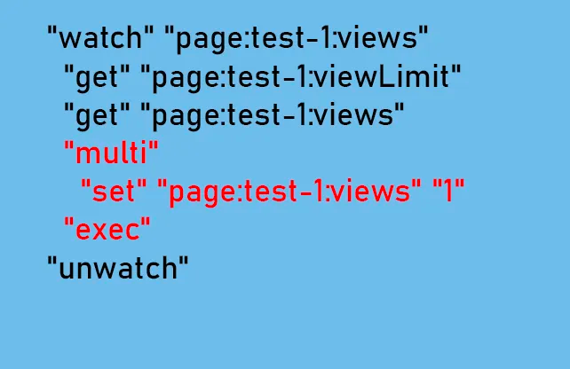

# Redis Performance and Atomicity in Golang: Unleash the Power of Pipelines, Transactions, and Lua Scripts

[原文地址](https://itnext.io/redis-performance-and-atomicity-in-golang-unleash-the-power-of-pipelines-transactions-and-lua-f2f4779ef2ba)

***通过Upstash可以免费创建一个Redis/Kafka集群，每天可以在免费的套餐上使用最多10k个请求。***

  Redis 是一项深受喜爱的技术，已在大多数产品中使用。虽然开始使用 Redis 并将其集成到代码库中非常简单，但它提供了一些您以前可能没有见过的有用功能。
  在本文中，我们讨论 Redis 中的管道、事务和 Lua 脚本，以及如何使用它们来提高性能和可靠性。

# 使用Redis来缓存文章

​	想象一个场景，我们有一个受欢迎的博客，需要缓存帖子以每秒处理许多请求。假设我们有一个job，从数据库中检索所有帖子，并在 Redis 丢失内存或由于任何其他原因为空时加载到redis中。



​	它尽可能简单，但我们可以采用不同的方法来解决这个问题。最简单的方法是用帖子一张一张地填充缓存，每个帖子有一个请求。

首先，让我们创建一个简单的函数来模拟数据库的行为：

```go
type Post struct {
   Slug    string // the unique identifier
   Content string
}

func GetLastNPostsFromDatabase(n int) []Post {
   var posts []Post
   for i := 0; i < n; i++ {
      posts = append(posts, Post{
         Slug:    fmt.Sprintf("post-%d-slug", i),
         Content: fmt.Sprintf("Some random content for the post #%d", i),
      })
   }
   return posts
}
```

然后，我们可以将这些帖子一一保存：

```go
func FillCacheWithPostsOneByOne(ctx context.Context, rdb *redis.Client, posts []Post) error {
   for _, post := range posts {
      // save each post one by one
      if err := rdb.Set(ctx, fmt.Sprintf("post:%s", post.Slug), post.Content, 0).Err(); err != nil {
         return err
      }
   }
   return nil
}
```

​	如您所见，FillCacheWithPostsOneByOne 函数需要 Redis 客户端。要连接到 Redis，您可以使用 Docker 或独立安装或 Upstash 的免费 Redis 集群在您的计算机中安装 Redis。

​	如果您想使用本地 Redis 实例，可以使用以下代码进行连接：

```go
rdb := redis.NewClient(&redis.Options{})
```

或者，如果您使用 Upstash，您可以轻松地从仪表板复制连接代码。



```go
func main() {
   rdb := ...

   startTime := time.Now()
   posts := GetLastNPostsFromDatabase(100)
   if err := FillCacheWithPostsOneByOne(context.Background(), rdb, posts); err != nil {
      log.Printf("error while filling the cache: %v\n", err)
   }
   fmt.Println("took ", time.Since(startTime))
}
```

​	如果运行代码，根据您的计算机距离 Redis 服务器的距离，大约需要 100 毫秒，这并不是一个大数字。然而，在本例中，我们假设数据库中有 100 个帖子。如果我们有一百万怎么办？如果每个请求大约需要 1 毫秒，则大约需要 16 分钟。

## 是什么让它变慢

- Redis实例和客户端之间的延迟
- Redis必须为每个请求进行系统调用
- 客户端的I/O开销

以下是这些i问题的一些解决方案：

## Pipelines 一次性发送所有请求

​	Redis 允许通过一个请求一次性发送所有请求。这种方法称为管道。简而言之，您可以创建一个请求列表，获取和/或设置请求，并将它们一起发送到 Redis 实例，Redis 执行完所有请求后，将结果发送回客户端。



正如您所看到的，Redis 立即接收所有命令，执行它们，然后一起返回所有结果。它非常适合这个用例！

```go
func FillCacheWithPostsInBatches(ctx context.Context, rdb *redis.Client, posts []Post) error {
   _, err := rdb.Pipelined(ctx, func(pipe redis.Pipeliner) error {
      for _, post := range posts {
         // save each post one by one
         if err := pipe.Set(ctx, fmt.Sprintf("post:%s", post.Slug), post.Content, 0).Err(); err != nil {
            return err
         }
      }
      return nil
   })
   return err
}
```

​	使用 go-redis，您可以使用 Pipelined 方法并在函数中编写代码，也可以使用 Pipeline 方法，该方法返回一个管道实例，可用于向管道添加新命令，然后执行。

​	结果令人着迷！对于 100 个帖子，需要 7 毫秒。对于 1k 个帖子，需要 7ms，对于 10k 个帖子，只需要 24ms。让我们将其与最后一种方法进行比较：



​	对于 100 万个帖子，只需大约 2 秒即可完成，而不是 16 分钟。这是一个巨大的进步。如果由于任何原因，缓存变空，它几乎可以立即被填满。

​	*在这个特定场景中，我可以使用 MSet 来代替。 Redis 主要支持使用 M 命令（例如 MSet、MGet 和 HMset）运行具有多个值的同一命令。但是，您无法在一个请求中运行不同的命令，而是可以使用管道。*

### Pipeline 存在的限制

- 如果您需要某个键的值，您会在执行所有命令后收到它。您无法实现需要某些键的值来修改其他键的值的逻辑。我们将在本文的后面部分讨论这个问题。
- 管道不是事务。其他Redis客户端可以发出请求并在管道的命令之间运行。



## Transation 执行过程中不能执行其他命令

​	Redis 是一个单核应用程序。在大多数情况下，您并不关心原子性，因为 Redis 本质上是原子性的，并且提供了一些很棒的命令，例如 INCRBY，因此您不需要获取、更改和设置可能导致不一致的值。

​	事务允许一步执行一组命令。 Redis 按顺序执行这组命令，并且不会执行其间其他请求中的其他命令。

​	事务的一大好处是 WATCH 命令。一般来说，如果 WATCHed key 在事务期间没有更改，您可以要求 Redis 应用更改。

​	让我们讨论一个新场景。想象一下我们需要限制页面的查看次数。例如，我们希望一页仅被查看十次。想想像赠品这样的事情，只有前十个人才能看到代码。我们如何通过 Redis 和事务来实现这一点？

### 使用Watch进行乐观锁

*监视“WATCH”键以检测对它们的更改。如果在“EXEC”命令之前至少修改了一个监视的键，则整个事务将中止，并且“EXEC”返回一个 Null 回复以通知事务失败。*

一般来说，这意味着我们可以有一个监视键的列表，在获取它们并运行逻辑后，如果它们没有改变，我们可以用事务保存逻辑结果。否则，交易将会失败。

```go
func MakeNewPage(ctx context.Context, rdb *redis.Client, slug string, viewLimit int) error {
   if err := rdb.Set(ctx, fmt.Sprintf("page:%s:views", slug), 0, 0).Err(); err != nil {
      return fmt.Errorf("error while saving page default view: %v", err)
   }
   if err := rdb.Set(ctx, fmt.Sprintf("page:%s:viewLimit", slug), viewLimit, 0).Err(); err != nil {
      fmt.Errorf("error while setting page view limit: %v", err)
   }
   return nil
}
```

```go
func CheckIfCanVisitPageWithoutTransaction(ctx context.Context, rdb *redis.Client, slug string) (bool, error) {
   limit, err := rdb.Get(ctx, fmt.Sprintf("page:%s:viewLimit", slug)).Int()
   if err != nil {
      return false, fmt.Errorf("error while getting page view limit: %v", err)
   }

   currentViews, err := rdb.Get(ctx, fmt.Sprintf("page:%s:views", slug)).Int()
   if err != nil {
      return false, fmt.Errorf("error while getting page's current views: %v", err)
   }

   // the page has reached its view limit
   if currentViews >= limit {
      return false, nil
   }

   // adding the new view
   if err := rdb.Set(ctx, fmt.Sprintf("page:%s:views", slug), currentViews+1, 0).Err(); err != nil {
      // if an error happens the view has not been added, and we don't show the user the page
      return false, fmt.Errorf("error while saving page default view: %v", err)
   }
   return true, nil
}
```

​	然后，通过这个函数，我们可以检查用户是否可以看到该页面。它接收查看次数限制和页面的当前查看次数，如果用户可以看到该页面，它将查看次数增加一。

但是这种实现是并发不安全的。



​	想象一下两个用户同时访问该页面。两个用户最终都会访问该页面，最终的访问次数将为 10，而不是 11。

​	我们怎样才能预防这个问题呢？实际上我们有两种方法来解决这个问题。

1、我们可以在一个lua脚本中运行整个逻辑。Redis中的Lua脚本以原子方式运行。因此第二个用户等到第一个用户完成计算后，访问次数将为11，第二个用户将看不到优惠码。

2、我们可以同时运行两者，但是在执行过程中，如果访问键值的值发生更改，Redis不会设置新的值并终止事务。

## 使用Watch修复查看次数限制 

​	所以，首先我们需要定义Redis需要watch的key。查看计数器键是导致问题的关键，因此，我们将观察这个键。然后，在接收到所有密钥并完成计算后，我们使用事务来保存最终值。

```go

func CheckIfCanVisitPageWithoutTransaction(ctx context.Context, rdb *redis.Client, slug string) (bool, error) {
   viewLimitKey := fmt.Sprintf("page:%s:viewLimit", slug)
   viewsKey := fmt.Sprintf("page:%s:views", slug)

   canView := false
   return canView, rdb.Watch(ctx, func(tx *redis.Tx) error {
      // using tx instead of rdb ensures if those values has changed, the transaction will fail
      limit, err := tx.Get(ctx, viewLimitKey).Int()
      if err != nil {
         return fmt.Errorf("error while getting page view limit: %v", err)
      }

      currentViews, err := tx.Get(ctx, viewsKey).Int()
      if err != nil {
         return fmt.Errorf("error while getting page's current views: %v", err)
      }

      // the page has reached its view limit
      if currentViews >= limit {
         return nil
      }

      _, err = tx.TxPipelined(ctx, func(pipe redis.Pipeliner) error {
         // adding the new view
         if err := pipe.Set(ctx, viewsKey, currentViews+1, 0).Err(); err != nil {
            // if an error happens the view has not been added, and we don't show the user the page
            return fmt.Errorf("error while saving page default view: %v", err)
         }
         return nil
      })

      if err != nil {
         return fmt.Errorf("error while executing the pipeline: %v", err)
      }
      canView = true
      return nil

   }, viewsKey)

}
```

​	正如您所看到的，我将viewsKey传递给了watch方法，并且在回调中，我使用了TxPipelined，它将命令包装在Redis中的MULTI/EXEC块中。因此，总而言之，在从 Redis 获取值之前，我指定了视图键，然后在获取键并完成一些工作之后，我使用事务将新值保存在 Redis 中，如果事务位于 WATCH 命令内，则它如果该值发生更改，将会失败。

现在，让我们模拟一个 WATCHed key 被更改的场景。

```go
package main

import (
   "context"
   "fmt"
   "github.com/redis/go-redis/v9"
   "sync"
   "time"
)

func MakeNewPage(ctx context.Context, rdb *redis.Client, slug string, viewLimit int) error {
   if err := rdb.Set(ctx, fmt.Sprintf("page:%s:views", slug), 0, 0).Err(); err != nil {
      return fmt.Errorf("error while saving page default view: %v", err)
   }
   if err := rdb.Set(ctx, fmt.Sprintf("page:%s:viewLimit", slug), viewLimit, 0).Err(); err != nil {
      fmt.Errorf("error while setting page view limit: %v", err)
   }
   return nil
}

func CheckIfCanVisitPageWithoutTransaction(ctx context.Context, rdb *redis.Client, slug string) (bool, error) {
   viewLimitKey := fmt.Sprintf("page:%s:viewLimit", slug)
   viewsKey := fmt.Sprintf("page:%s:views", slug)

   canView := false
   return canView, rdb.Watch(ctx, func(tx *redis.Tx) error {
      // using tx instead of rdb ensures if those values has changed, the transaction will fail
      limit, err := tx.Get(ctx, viewLimitKey).Int()
      if err != nil {
         return fmt.Errorf("error while getting page view limit: %v", err)
      }

      currentViews, err := tx.Get(ctx, viewsKey).Int()
      if err != nil {
         return fmt.Errorf("error while getting page's current views: %v", err)
      }

      <-time.After(time.Second) // added manual delay

      // the page has reached its view limit
      if currentViews >= limit {
         return nil
      }

      _, err = tx.TxPipelined(ctx, func(pipe redis.Pipeliner) error {
         // adding the new view
         if err := pipe.Set(ctx, viewsKey, currentViews+1, 0).Err(); err != nil {
            // if an error happens the view has not been added, and we don't show the user the page
            return fmt.Errorf("error while saving page default view: %v", err)
         }
         return nil
      })

      if err != nil {
         return fmt.Errorf("error while executing the pipeline: %v", err)
      }
      canView = true
      return nil

   }, viewsKey)

}

func main() {
   rdb := redis.NewClient(&redis.Options{})

   if err := MakeNewPage(context.Background(), rdb, "test-1", 10); err != nil {
      panic(err)
   }

   var wg sync.WaitGroup
   wg.Add(2)
   go func() {
      can, err := CheckIfCanVisitPageWithoutTransaction(context.Background(), rdb, "test-1")
      if err != nil {
         panic(err)
      }
      fmt.Println("Can #1", can)
      wg.Done()
   }()
   go func() {
      <-time.After(time.Millisecond * 500) // to ensure the first one will change the second one's value
      can, err := CheckIfCanVisitPageWithoutTransaction(context.Background(), rdb, "test-1")
      if err != nil {
         panic(err)
      }
      fmt.Println("Can #2", can)
      wg.Done()
   }()
   wg.Wait()

}
```

返回结果：

```go
Can #1 true
panic: error while executing the pipeline: redis: transaction failed
```

可以看到，交易失败成功！然而，该页面只有一个查看次数，用户必须能够看到该页面。我们不能返回500。该代码需要重试。

```go
func TransactionWithRetry(callback func() error, maxRetries int) error {
   retries := 0
   for {
      err := callback()
      // the transaction executed successfully
      if err == nil {
         return nil
      }

      if errors.Is(err, redis.TxFailedErr) {
         retries++
         fmt.Println("> retry happened.")
         if retries > maxRetries {
            return ErrMaxRetriesReached
         }
         continue
      }

      // something unexpected happened
      return err

   }
}
```

​	要了解发生的情况，您可以使用 MONITOR 命令来记录每个命令。这就是正在发生的事情：

```sh
1696485643.305621 [0 172.17.0.1:46678] "watch" "page:test-1:views"
1696485643.306484 [0 172.17.0.1:46678] "get" "page:test-1:viewLimit"
1696485643.307711 [0 172.17.0.1:46678] "get" "page:test-1:views"
1696485644.311047 [0 172.17.0.1:46678] "multi"
1696485644.311065 [0 172.17.0.1:46678] "set" "page:test-1:views" "1"
1696485644.311069 [0 172.17.0.1:46678] "exec"
1696485644.312144 [0 172.17.0.1:46678] "unwatch"
```

​	了解正在发生的事情很重要。正如您所看到的，代码分为两个范围：WATCH 和 MULTI/EXEC。



​	正如我之前提到的，只有 MULTI/EXEC 之间的命令组才会阻止 Redis 执行其他命令。因此，代码的其他部分可以与其他 Redis 命令同时执行。这意味着Redis可以具有更好的整体性能。但是，正如下一部分所讨论的，如果您使用 Lua 脚本，则在 Lua 脚本完全执行之前，Redis 不会响应其他请求。

### 完全原子性的Lua脚本

​	现在我们了解了 Redis 中事务的工作原理，我们可以讨论 Lua 脚本并将它们与 MULTI/EXEC 进行比较。一般来说，我们将Lua脚本发送到Redis服务器一次，然后我们可以使用不同的参数调用该脚本来执行。除了Lua脚本的完全原子性之外，它还可以减少由于在Redis实例内部执行而导致的复杂逻辑的延迟。然而，对于简单的使用，它比使用内置命令慢得多。因此，始终尝试使用内置命令或 Redis 事务寻找替代解决方案，然后如果有意义，请使用 Lua 脚本。

​	Lua 脚本将在执行其他命令时阻止 Redis 执行它们！像 PostgreSQL 这样的数据库通过其多版本并发控制（MVCC）系统提供对事务并发执行的支持。每笔交易都独立于其数据运行。然而，Redis是单核的，可以同时运行一个命令。因此，从本质上讲，Lua 脚本会使用该核心，直到执行完成。

让我们将视图限制逻辑转换为Lua脚本（script.lua）：

```lua
local viewLimit = redis.call("GET", "page:" .. KEYS[1] .. ":viewLimit")
local currentViews = redis.call("GET", "page:" .. KEYS[1] .. ":views")
-- convert them to a number. redis.call("GET") returns a string
viewLimit = tonumber(viewLimit)
currentViews = tonumber(currentViews)
-- the viewing limit has been reached
if currentViews >= viewLimit then
    return "no"
end
-- the user can view the page, let's add a new view to the views key
redis.log(redis.LOG_WARNING, currentViews)
redis.call("SET", "page:" .. KEYS[1] .. ":views", currentViews + 1)
return "yes"
```

​	在您的脚本中，您可以使用“redis”API 访问 Redis。请注意“redis.call”返回一个字符串。您可以使用“tonumber”函数将其转换为数字。


```go
func main() {
   rdb := redis.NewClient(&redis.Options{})

   if err := MakeNewPage(context.Background(), rdb, "test-1", 10); err != nil {
      panic(err)
   }

   scriptContent, _ := os.ReadFile("./script.lua")
   script := redis.NewScript(string(scriptContent))

   var wg sync.WaitGroup
   for i := 0; i < 20; i++ {
      wg.Add(1)
      go func(i int) {
         can, err := script.Run(context.Background(), rdb, []string{"test-1"}).Result()
         if err != nil {
            panic(err)
         }
         fmt.Printf("can #%d = %v\n", i, can)
         wg.Done()
      }(i)
   }
   wg.Wait()

}
```


​	我通过调用“NewScript”函数创建了一个新脚本。 Redis 的好处是您不需要每次执行脚本时都上传脚本。 go-redis 包将脚本转换为 sha 哈希值，第一次上传脚本后，它使用该哈希值执行后续命令。

### 两种方式对比

- Lua script 花了100ms
- Transaction with retry 花了4s

​	对于Lua脚本，我们用一条命令运行脚本，Redis实例内的脚本可以访问数据，而无需任何往返时间。另一方面，事务必须向 Redis 服务器发出七个不同的请求，这增加了很多延迟：

```sh
1696488282.976886 [0 172.17.0.1:49286] "watch" "page:test-1:views"
1696488282.977527 [0 172.17.0.1:49286] "get" "page:test-1:viewLimit"
1696488282.978079 [0 172.17.0.1:49286] "get" "page:test-1:views"
1696488283.989333 [0 172.17.0.1:49286] "multi"
1696488283.989357 [0 172.17.0.1:49286] "set" "page:test-1:views" "2"
1696488283.989360 [0 172.17.0.1:49286] "exec"
1696488283.990405 [0 172.17.0.1:49286] "unwatch"
```

​	这就是go-redis 限流器为什么使用Lua脚本来实现的主要原因，[您可以在这里读到更多内容。](https://github.com/go-redis/redis_rate/blob/v10/lua.go)

# 结论

总之，Redis 提供了一系列可以极大增强应用程序的性能和可靠性的功能。了解何时以及如何使用管道、事务和 Lua 脚本可以使我们在项目中充分发挥 Redis 的潜力。
