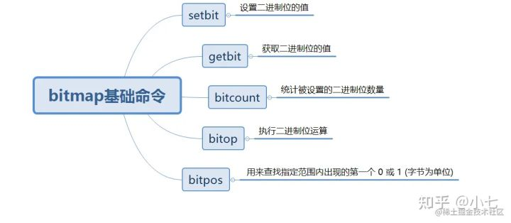

# Redis bitmap
bitmap 是由多个二进制组成的数组。数组中的每个二进制位都有与之对应的偏移量，可以通过这些偏移量对位图中指定的一个或多个二进制位进行操作。

## 数据结构


## 基础操作



### SETBIT
*TIPS: offset 的最大值是2^32次方（4294967296）*
- setbit key offset value 

当用户执行setbit命令时,如果位图不存在，或者位图当前的大小无法满足用户想要执行的设置操作，那么Redis将对被设置的位图进行扩展，使得位图可以满足用户的设置请求。

比如执行如下命令：
```redis
setbit mbit 10 1
```

Redis创建出的位图并不是只有11个二进制位，而是有两个字节共16个二进制位，如下图所示。


说明：从个图我们也可以看到,除了偏移量为10的二进制位之外，其他所有未被设置的二进制位都被初始化成了0。

从这里可以看到如果我们直接SETBIT mbit 4294967295 1 的话，这个key占用内存会直接达到671088704个字节数约等于640MB.
在这种场景下，如果前面的offset没有利用起来的话，相比于直接使用string做签到日志等功能是bitmap的优势就不存在了。

可以使用MEMORY USAGE key查看key所占内容字节数。


### GETBIT key offset
```redis
getbit key offset
```

### bitcount
统计被设置的二进制位数量
```redis
bitcount key start end
```

### bitop
bitop 对一个或多个保存二进制位的字符串 key 进行位元操作

```redis
bitop and key1 key2
```

说明: bitop 命令支持 and、or、not、xor这四种操作

- and: 与运算符（&） 两个同时为1，结果为1，否则为0
- or: 或运算（|） 一个为1，其值为1
- not: 取反(0110 0001 NOT: 1001 1110)
- xor: 异或运算,值不同为1，否则为0

### bitpos
bitpos 用来查找指定范围内出现的第一个 0 或 1 (字节为单位)
```redis
bitpos key start end
```
应用场景：可以用于查询某段时间内第一个签到的玩家

## 应用场景
- 签到 1 代表签到，0 代表未签到，这样可以很轻松地统计出用户的活跃程度。相比于直接使用字符串而言，位图中的每一条记录仅占用一个bit位，从而大大降低了内存空间使用率。
- 统计登录天数 
