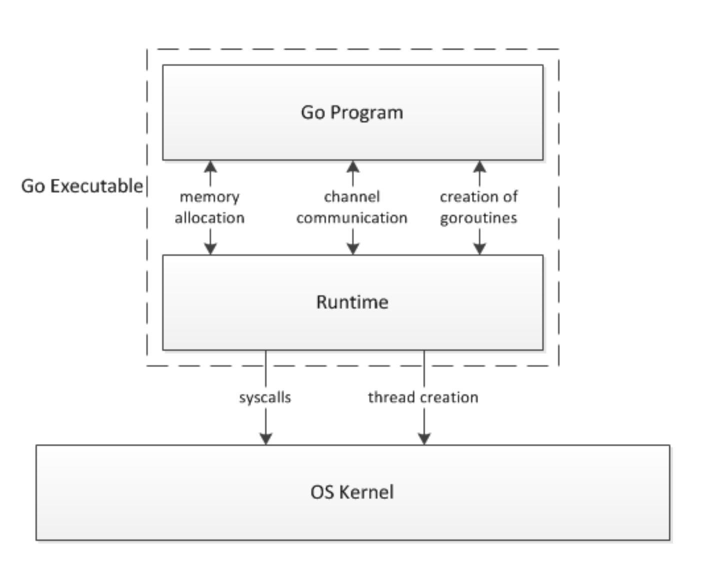
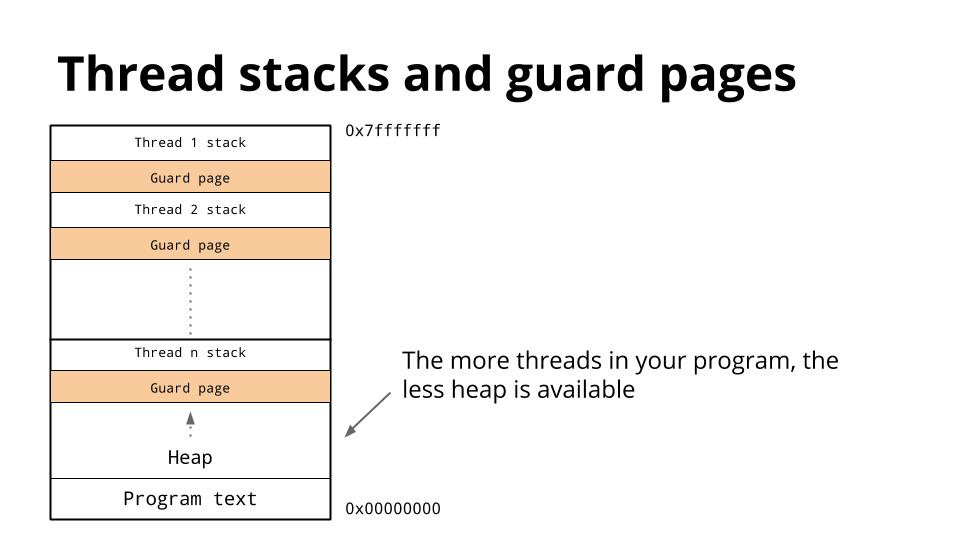
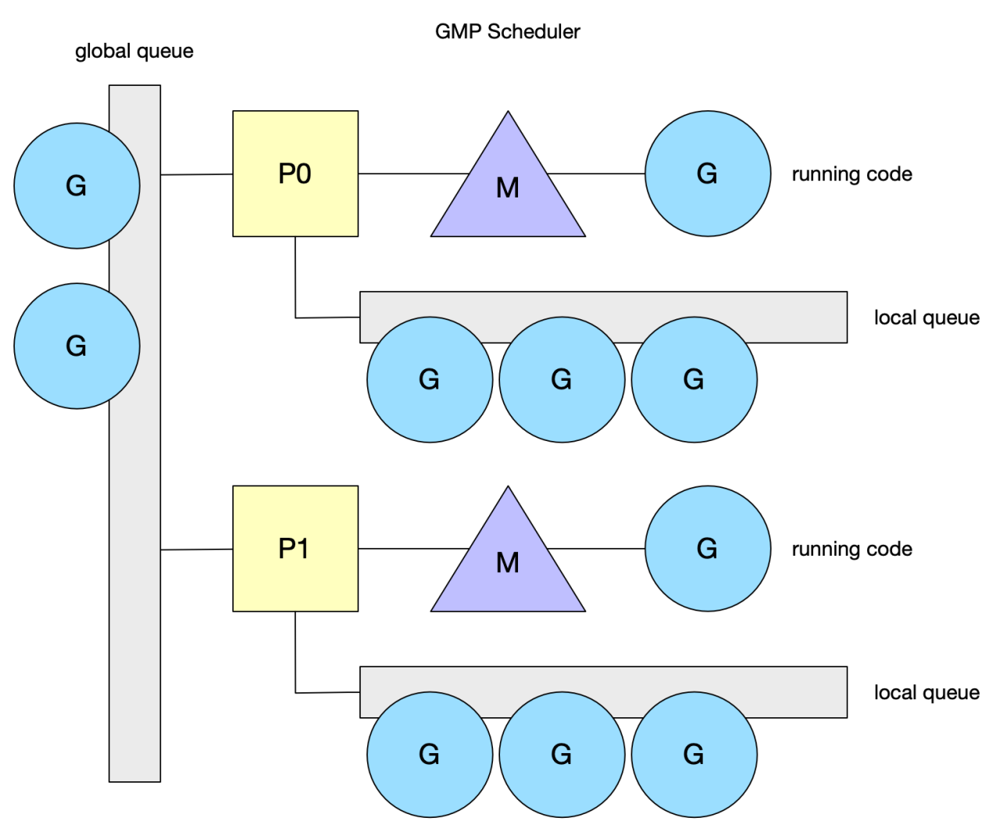
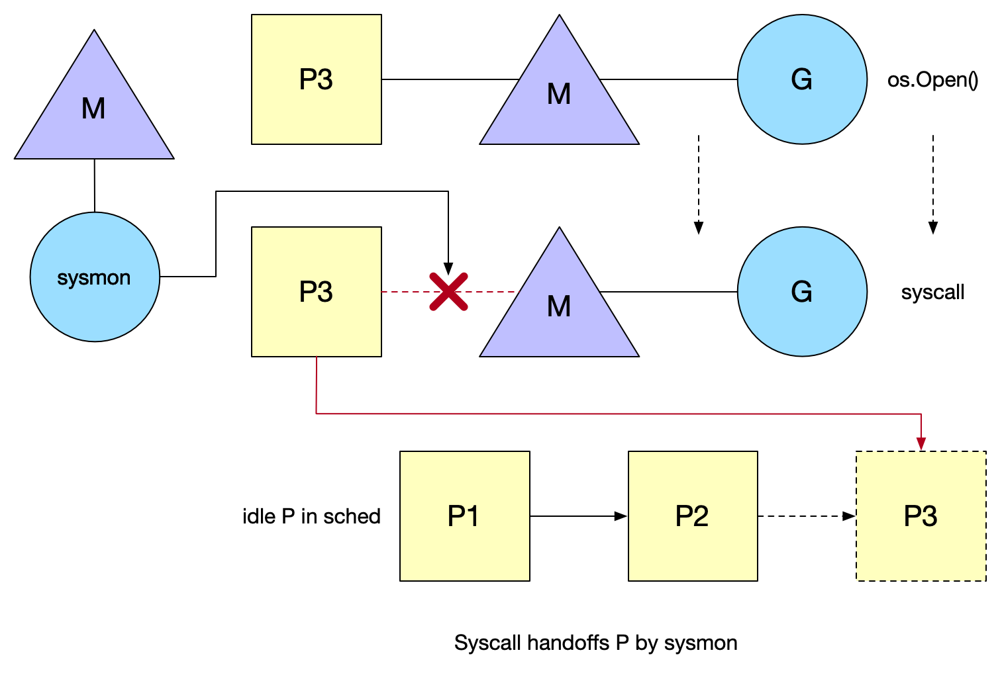
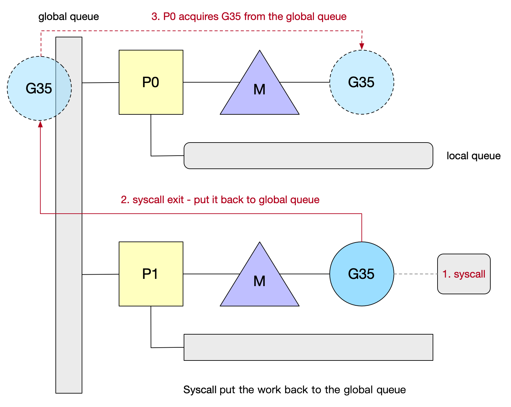
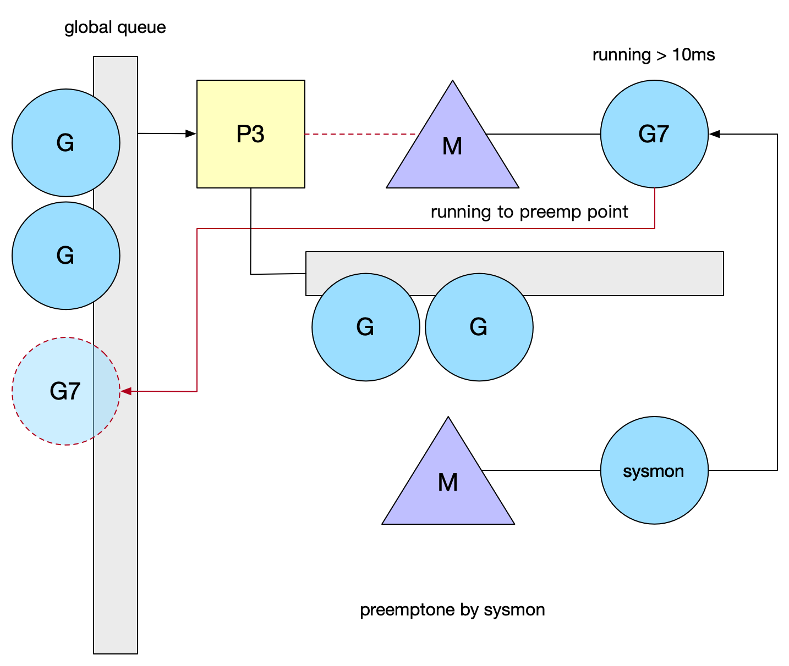
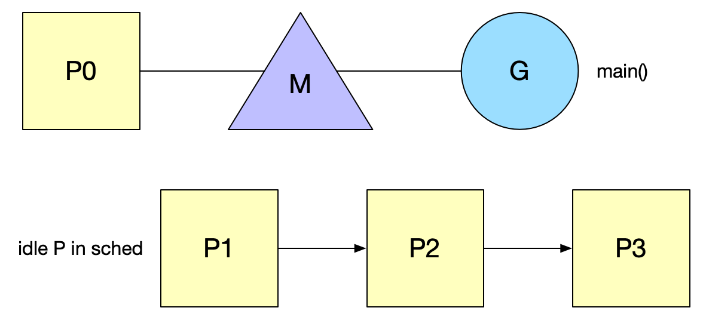

# Goroutine 原理

## Goroutine

Goroutine是一个与其他goroutines并行运行在同一地址空间的Go函数或方法。一个运行的程序由一个或更多个goroutine组成。它与线程、协程等不同。它是一个goroutine。

Goroutines 在同一个用户地址空间里并行独立执行 functions，channels 则用于 goroutines 间的通信和同步访问控制。

## goroutine 和 thread的区别

### 内存占用，创建一个goroutine的栈内存消耗为2KB，运行过程中没如果栈空间不够用，会自动进行扩容。

### 创建/销毁，线程创建和销毁都会有巨大的消耗，是内核级的交互。

### 调度切换

抛开陷入内核，线程切换会消耗1000-1500纳秒。goroutine的切换为200ns。因此，goroutines切换成本比threads要小得多。

### 复杂性

线程的创建和退出复杂，多个thread间通讯负责。

不能大量创建线程(参考早期的 httpd)，成本高，使用网络多路复用，存在大量callback(参考twemproxy、nginx 的代码)。对于应用服务线程门槛高，例如需要做第三方库隔离，需要考虑引入线程池等。

### M:N 模型

Go创建M个线程（CPU执行调度的单元，内核的task_struct），之后创建的N个goroutine都会依附在这M个线程上执行，即M:N模型。他们能够同时运行，与线程类型，但相比之下非常轻量。因此程序运行时，Goroutines的个数应该是远大于线程的个数的。

## GMP调度模型

## G

goroutine的缩写，每次go func() 都代表一个G，无限制。

使用struct runtime.g，包含了当前goroutine的状态，堆栈，上下文。

## M

工作线程（OS thread）也被称为Machine，使用struct runtime.m, 所有M是有线程栈的。

## P

P是一个抽象的概念，并不是真正的物理CPU。

引入一个结构 P，它代表了 M 所需的上下文环境，也是处理用户级代码逻辑的处理器。它负责衔接 M 和 G 的调度上下文，将等待执行的 G 与 M 对接。当 P 有任务时需要创建或者唤醒一个 M 来执行它队列里的任务。所以 P/M 需要进行绑定，构成一个执行单元。P 决定了并行任务的数量，可通过 runtime.GOMAXPROCS 来设定。在 Go1.5 之后GOMAXPROCS 被默认设置可用的核数，而之前则默认为1。

## GM调度器

Go1.2前的调度器实现，限制了Go并发程序的伸缩性，尤其是对那些有高吞吐或并行计算需求的服务程序。

### GM调度模型的问题

- 单一全局互斥锁（Sched.Lock）和集中状态存储（导致所有goroutine相关操作，比如Lc 创建、结束、重新调度等都要上锁。）
- Goroutine传递问题（M经常在M之间传递“可运行”的goroutine，这导致调度延迟增大以及额外的性能损耗）
- Per-M持有内存缓存（M.mcache）

每个 M 持有 mcache 和 stackalloc，然而只有在 M 运行 Go 代码时才需要使用的内存(每个 mcache 可以高达2mb)，当 M 在处于 syscall 时并不需要。运行 Go 代码和阻塞在 syscall 的 M 的比例高达1:100，造成了很大的浪费。同时内存亲缘性也较差，G 当前在 M 运行后对 M 的内存进行了预热，因为现在 G 调度到同一个 M 的概率不高，数据局部性不好。

*内存亲缘性*

- 严重的线程阻塞/解锁

在系统调用的情况下，工作线程经常被阻塞和取消阻塞，这增加了很多开销。比如M找不到G，此时M就会进入频繁阻塞/唤醒来进行检查的逻辑，以便及时发现新的G来执行。

## GMP 调度器

引入了local queue，因为P的存在，runtime并不需要做一个集中式的goroutine调度，每个M都会在local queue、global queue或者其他P队列中找G执行，减少全局锁对性能的影响。

这也是GMP Work-stealing调度算法的核心。注意P的本地G队列还有可能面临一个并发访问的场景，为了避免加锁，这里P的本地队列是一个*LockFree*的队列，窃取G时使用*CAS*原子操作来完成。

## Work-stealing调度算法(窃取机制)

当一个P执行完本地所有的G之后，并且全局队列为空的时候，会尝试挑选一个受害者P，从它的G队列中窃取一半G。否则会从全局队列中获取（当前个数/GOMAXPROCS）个G。

*即goroutine的窃取机制*

除了窃取失败时获取之外，P的调度算法中还会每个N轮调度之后就去全局队列拿一个G。

*新建 G 时 P 的本地 G 队列放不下已满并达到256个的时候会放半数 G 到全局队列去，阻塞的系统调用返回时找不到空闲 P 也会放到全局队列。*

### Syscall

调用syscall后会解绑P，然后M和G进入阻塞，而P此时的状态就是syscall，表明这个P的G正在syscall中，而这时的P是不能被调度给别的M的。如果在短时间内阻塞的M就唤醒了，那么M会优先来重新获取这个P，能获取到就继续绑回去，这样有利于数据的局部性（即亲缘性）。

*系统监视器 (system monitor)，称为 sysmon，会定时扫描。在执行 syscall 时, 如果某个 P 的 G 执行超过一个 sysmon tick(10ms)，就会把他设为 idle，重新调度给需要的 M，强制解绑*

超过10ms的syscall之后会由*sysmon*强制解绑。

P1和M脱离后目前在idel list 中等待被绑定（处于syscall状态）。而syscall借宿后M按照如下规则执行知道满足其中一个条件：

- 尝试获取同一个P(P1），恢复执行G
- 尝试获取idle list 中其他空闲P，恢复执行G。
- 找不到空闲P，把G放回global queue，M放回idle list

### OS thread

当使用了syscall，Go无法限制Blocked OS threads 的数量。

### Spining thread （线程自旋）

线程自旋是相对于线程阻塞而言的，表象就是循环执行一个指定逻辑（调度逻辑，目的是不停地寻找G）。缺点是：如果G迟迟不来，CPU会白白浪费在这无意义的计算上。优点是：降低了M的上下文切换成本，提高性能。产生自旋的两个地方：

- 类型1:M不带P的找P挂载。（一有 P 释放就结合）
- 类型2:M带P的找G运行。（一有 runable 的 G 就执行）

*为了避免过多浪费 CPU 资源，自旋的 M 最多只允许 GOMAXPROCS (Busy P)。同时当有类型1的自旋 M 存在时，类型2的自旋 M 就不阻塞，阻塞会释放 P，一释放 P 就马上被类型1的自旋 M 抢走了，没必要。*

### GMP问题总结

- 单一全局互斥锁和集中状态存储

  G 被分成全局队列和 P 的本地队列，全局队列依旧是全局锁，但是使用场景明显很少，P 本地队列使用无锁队列，使用原子操作来面对可能的并发场景。

- Goroutine传递问题

G 创建时就在 P 的本地队列，可以避免在 G 之间传递（窃取除外），G 对 P 的数据局部性好; 当 G 开始执行了，系统调用返回后 M 会尝试获取可用 P，获取到了的话可以避免在 M 之间传递。而且优先获取调用阻塞前的 P，所以 G 对 M 数据局部性好，G 对 P 的数据局部性也好。

- Per-M 持有内存缓存 (M.mcache)

 内存 mcache 只存在 P 结构中，P 最多只有 GOMAXPROCS 个，远小于 M 的个数，所以内存没有过多的消耗。

- 严重的线程阻塞/解锁

   通过引入自旋，保证任何时候都有处于等待状态的自旋 M，避免在等待可用的 P 和 G 时频繁的阻塞和唤醒。

### sysmon

sysmon 也叫监控线程，它无需 P 也可以运行，他是一个死循环，每20us~10ms循环一次，循环完一次就 sleep 一会，为什么会是一个变动的周期呢，主要是避免空转，如果每次循环都没什么需要做的事，那么 sleep 的时间就会加大。

- 释放限制超过5分钟的span物理内存
- 如果超过2分钟没有垃圾回收，强制执行
- 将长时间未处理的netpoll添加到全局队列
- 向长时间运行的G任务发出抢占调度
- 收回因syscall长时间阻塞的P

当 P 在 M 上执行时间超过10ms，sysmon 调用 preemptone 将 G 标记为 stackPreempt 。因此需要在某个地方触发检测逻辑，Go 当前是在检查栈是否溢出的地方判定(morestack())，M 会保存当前 G 的上下文，重新进入调度逻辑。

## Goroutine Lifecucle

### Go 程序启动

# 内存分配原理

# GC原理

# Channel原理

